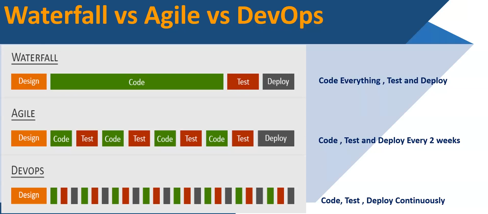

# 01. Intro [ 27/09/2025 ]

---

Outcomes

- Excellent in Fundamentals
- Linux Commands
- DevOps Tools
- AWS Core Services
- DevOps with AWS
- DevSecOps
- ~ 10 E2E Projects
- Interview Questions
- Troubleshooting
- Security and Architecting
- Resumes

## Job Roles you can apply

- AWS
    - AWS Engineer
    - AWS Cloud Engineer
    - AWS Cloud Architect
    - AWS Support Engineer
- DevOps
    - DevOps Engineer
    - AWS DevOps Engineer
    - SRE Role
    - Cloud Engineer
    - Platform Engineer

## Why to Choose AWS..?

- AWS is the Fastest Growing Public Cloud in the World
- AWS is the leader in the Cloud Computing market.
- Increased “Enterprise Cloud Migration” to AWS
- Affordable Pricing and Access to Free Tier for Learning AWS
- AWS is Quickly Becoming the Gold Standard of the Cloud
- AWS is used by Many of the Major Businesses [ like Network ]
- AWS Skills are High in Demand & Pays more Money

## Benefits of Certifications

- Increase in Salary
- Door opener for new opportunities
- New level of your expertise
- It Proves Your Expertise and Promotes Credibility with Employer and Peers
- You'll become an integral part of AWS community
- AWS Amazon Certifications demonstrate commitment to a profession

<aside>
💡

Certification:

---

- This course will help to get Certified in “AWS Solutions Architect”
</aside>

## SDLC

**Software Development Life Cycle (SDLC)** is a structured process that is used to design, develop, test & deploy high-quality software Systems Efficiently

- i.e., It defines the Life Cycle of Software Development
- The goal of the SDLC is to deliver high-quality, maintainable software systems that meets the user's requirements more Efficiently

SDLC:

1. Requirement Analysis → Involves gathering, analyzing, and documenting functional and non-functional requirements.
2. Planning → Defines project goals, scope, resources, costs, and risks.
3. Design → Translates requirements into a blueprint for the application. It Defines Architecture covering HLD, LLD, components, and user interfaces.
4. Development → Actual coding and development take place based on design specifications.
5. Test → Conducts various tests, such as unit testing, integration testing, system testing, and user acceptance testing (UAT).
6. Deploy → Releases the software to users after thorough testing.
7. Maintain → Ensures the software continues to operate as required. Address bug fixes etc..

