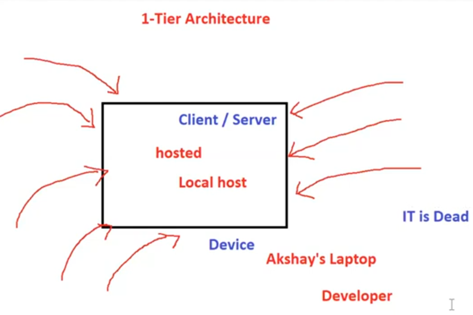

# 02. Client Server Architecture [ 10/10/2025 ]

---

## Basics

- `Client` → A Machine which Requests the Data
- `Server` → A Machine which Responds to the Request [ by Serving the Requested Data ]
    - It takes incoming request → Process it → Send back the response
    - It will be 24/7 Online
    - It will have public static IP
- Client will request the data → Server will process it & send back the Response
    - This is called Request Response Cycle
- Any Machine that is connected to a Network is called `Device`
    - Hence, Devices can Either be a Client or a Server
        - Any Device which Request data → Client
        - Any Device which Responds to Request → Server
- But for these devices to communicate with each other, they must be connected to a network
- Devices connect, communicate & exchange data with each other using `IP address`
- `IP address` → An Unique identification number assigned to a each server/device connected to a network [ like Aadhar No. ]
    - `Host-name` → Name of the Server/device [ like Aadhar name ]

## Client Server Architecture

`Client-server` architecture → A Network model where clients request services, and servers provide them.

- It allows different Applications to Connect with each other to communicate & exchange data over a network.

main types:

- 1-Tier Architecture
- 2-Tier Architecture
- 3-Tier Architecture
- N-Tier Architecture

<aside>
💡 Terminology

- The Presentation Layer → application that interacts with the user.
- The Application Layer→ application that performs the business logic.
- The Database Layer → software that manages the data for the system.
</aside>

## 1-Tier Architecture

- The application, business logic, and database reside on a single system.
    - This is essentially a standalone system where the client and server reside on the same machine.
    - i.e., Application is developed in a machine & the same machine is used to host the application [ like Localhost ]
    - No one from the outside can access this application [ except the developer/User who developed/Installed the application ]
    - Hence, This model is Not used for Web Applications

- Example: A desktop application like Microsoft Excel.
    - **Pros:** Simple to develop and deploy → One Person Usage
    - **Cons:** Poor scalability and security. → Client Server resides on same machine

## 2-Tier Architecture

- It will have 2 layers/Tier’s → Client Layer & Server Layer
- Server Layer contains both Application & Database → This is the major drawback of this model
    - Both Application & DB shares the common resources like RAM, CPU etc.. and fights for those resources
    - Hence, server will be slow & not responsive which leads to bad performance
    - Security is weaker as individual level security is NOT maintained since both lie in the same space.
        - i.e., If Hackers hacks Server Layer, both App Code & DB Data will be breached
- Hence, This is NOT recommended for Production environment [ But can be used for development environment ]

- Example: A basic web application
    - **Pros:** Faster communication between client and server. → Multiple User Access
    - **Cons:** Limited scalability & Security

## 3-Tier Architecture

- This Model, Introduces a New Layer called Middle Layer between client and server:
    - **Client Layer**: Handles the user interface.
    - **Application Layer** (Middle Tier): Processes business logic.
    - **Database Layer**: Stores and manages data.
- WKT, DB layer server must be private to ensure Data Security
- But if we make application layer private, clients won’t be able to access the application
- Hence, we will make it public
- Both of these servers connect & communicate using an `IP Address`

- Example: Most Modern Web applications with a frontend (React), a backend (Node.js),  and a database (MongoDB).
    - **Pros:** Improved security, scalability, and maintainability.
    - **Cons:** More complex than two-tier architecture.

## N-Tier Architecture

- In case of 3-Tier, we made application layer public for clients to access
    - But if we made app layer public → source code will also be public which is NOT recommended
    - Hence we make it private
    - But, If we make it Private, Client’s cannot access the App Layer
    - So It is a Deadlock
- i.e., why a New Layer is introduced called `web server`, which will be public for clients to access
- This web server will Takes the Requests & Re-directs to App server [ which is Private ]
- In this way, new layers will be added depending on required criteria (or) business logic, which makes a N-Tier Architecture

<aside>
💡

NOTE:

---

- `Application Server` → A Server which hosts the Application
- `DB Server` → A Server which hosts the Database
- `Web Server` → It takes the requests [ from Client ] & Re-directs to App Server
    - It is Just a `Config File` but doesn’t contain any code
    - EX: Apache2, nginx
- Application server should always be `private`

- Installation of an Application on a Server is called Hosting
- **`Hosting`** → Allocating **Storage and Computing resources on a server** so that a website, application, or service can be accessed over the **internet**
- `Web Server` → A Server which hosts Websites
    - Web Server will also Process & Deliver the Web pages to Clients/Users
    - Hence, `Web Server` → Server that hosts/Stores, Processes & Delivers/Serves the Web Pages to End-Users
- `DB Servers` → Servers which hosts, Processes & Serves the Data
</aside>

---

## Peer-to-Peer Architecture

- Unlike traditional client-server,
    - All devices (nodes) act as both clients and servers.
- Example: File-sharing networks like BitTorrent.
- **Pros:** No central dependency, more fault tolerance.
- **Cons:** Harder to manage and secure.

## Microservice Architecture

- The server is split into smaller, independent services, each handling specific tasks/Features and communicating via APIs.
- Example: Large-scale applications such as e-commerce platforms.

## IP Address

- IP → Internet Protocol
- `IP address` → An Unique identification number assigned to a each server/device connected to a network [ like Aadhar No. ]
    - `Host-name` → Name of the Server/device [ like Aadhar name ]

It serves two main purposes:

1. **Identification** – It uniquely identifies a device on a network.
2. **Communication** – It allows devices to communicate with each other over the network
3. **Routing**: IP addresses are crucial for routing data packets across networks. 
    - When you send information over the internet, it is broken down into packets.
    - Each packet includes the sender's IP address, the recipient's IP address, and other data.
    - Routers use this information to determine the most efficient path for the packet to reach its destination.