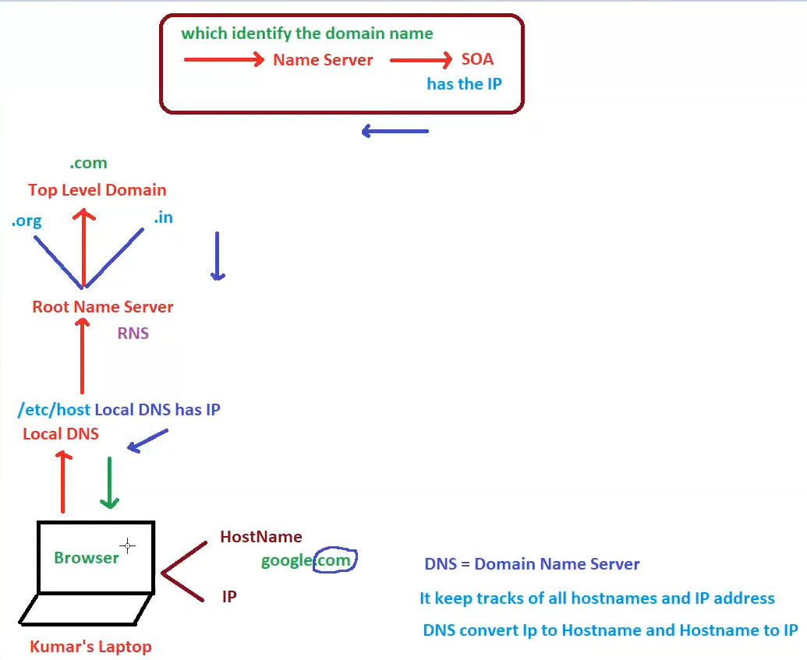

# 03. Working of a Client’s Request [ 13/10/2025 ]

---

<aside>
💡

NOTE:

---

- Browser/Client requires either Domain Name (or) IP address to connect to the server
- If Any device wants to connect to another device in the network, It needs the IP address of the Device
</aside>

## How the Client request works in a Browser..?

- WKT,
    - A Client to Send a Request, It needs IP Address [ of the Server ]
    - and To connect to any device, we need to be in same network & require the IP address of the device
- But the problem is, there are billions of devices → billions of IP address. Hence we can’t remember all the device’s IP address
- So Domain Names (or) Host Names are introduced to remember [ since humans are more prone to remember names instead of numbers ]
- These Domain names are mapped with corresponding IP addresses,
- So when we search using Domain names, it’s corresponding IP address will be fetched [ and  VICEVERSA ]
- And finally browser will connect & communicate to that particular device with IP address
- ex:
    - If we search for Google.com → This Google.com is a Domain Name (or) Hostname

## How IP & Host names are mapped..?

- ISP [ Internet Service Provider ] will map all the domain names with their corresponding IP addresses
- ISP uses DNS to store all these IP & Host names

## DNS

- DNS → Domain Name Server
- It stores all hostnames & IP addresses by mapping all of the IP addresses with their corresponding Hostnames [ like a phone book ]
- It Translates/Converts IP addresses into Hostnames & Vice versa
- Every device will have a copy of this DNS called Local DNS [ Location → `etc/host` ] which is copied from ISP’s

<aside>
💡

Any Device 1st refers the Local DNS to get the IP Address, but Not the DNS directly

</aside>

So, If Browser sends a Request using Domain Name [ instead of IP Address ], 

Then:

- WKT, each Device will have a copy of DNS called Local DNS
- This Local DNS will retrieve the IP Address mapped to Domain Name
- And Browser will be able to Request the Resource

## What If the local DNS couldn’t find the IP or Hostname..?

- Job of Local DNS → is to Provide the IP Address mapped to the requested Domain Name
- But, if the Website is New One → Then Local DNS won’t have the mapping
- Then Local DNS will send a request to RNS [ Root Name Server ] to get the IP mapped to the New Domain
- Job of RNS → is to Identify the extension/TLD [ .com, .org, .in etc.. ] of the Domain Name
    - i.e., if we search for Google.com → .com is identified by RNS
    - These extensions like .com, .in, org so on.. are called TLD [ Top Level Domain ]
- TLD [ Top Level Domain ] → Extension of the Domain Name
    - Millions of Domain Names will be Segregated based on the TLD
    - Each TLD will again have millions of Domain Names
    - Each Domain Name will have a Name Server & SOA [ Start of Authority ]
        - Name Server → Identifies the Incoming Domain name
        - SOA → Contains the Mapped IP Address
- Based on the TLD, RNS will redirect the request to respective TLD Group
    - Each TLD Group will have all of the Domain Names matching with the respective TLD
    - And each of these Domain Names [ inside the TLD Group ] will have an Identifier called Name Server
        - `Name Server` → which identifies the domain name
    - Once the Domain Name reaches respective TLD, Name Server will Identify the Domain Name
- Finally, the request from local DNS will be received by the NS [ `Name Server` → which identifies the domain name ], via TLD
- This NS has SOA [ Start of Authority ] which will have IP address mapped to this NS & finally Identifies the Domain name
- Finally this IP address [ Stored in SOA ]  is sent back to TLD → RNS → Local DNS → Browser

In Summary:

- Every Device will store a copy of the DNS locally & is called Local DNS
- Devices never asks the DNS to fetch the IP address for the corresponding Host name
    - First, Device will look into the Local DNS to fetch the IP address
    - If not found, then it will ask the RNS
    - RNS will identify the TLD from the Domain name & sends to the respective TLD group [ where millions of domains names with same TLD are stored ]
    - Now the corresponding Domain name will have the NS which identifies the incoming domain name using SOA & gives the IP address
    - Now this IP address is sent back to the requested Device which is used to connect to that respective Server

<aside>
💡

NOTE:

---

- `NS` [ Name Server ] → Which Identifies the Domain names & Serves the IP Address using SOA [ which will have IP address ]
- `Firewall` → allows/denies the incoming request to access the server/resource based on Network Protocols
    - Which stops unauthorized access to network
- `Load Balancer` → Distributes the incoming traffic/requests to multiple instances of servers [ based on Algorithm ]
    - `Web Server` also do’s the same thing
    - Hence, It will be replaced by LB [ as LB is a Service provided by AWS as ELB ]
</aside>

## How Request is received by Server

Once we get the IP address using Local DNS, our request will be sent to corresponding IP address Server

- First, Request will go through Server’s Firewall
    - `Firewall` → Stops/Restricts Un-Authorized access to the Network [ Device’s Network ]
        - i.e., It Allows/Denies the incoming request to access the server/resource based on Network Protocols
        - Firewall will only allow requests which follows these protocols
- Then, Request will hit the Web Server
    - `Web Server` → A Config File which takes incoming request & Re-directs to App Sever
- Finally request will be received by App Server
    - `App Server` will process the Request & Send a Response

But In Real Time, 

- There will be Multiple App Servers
- Why..?
    - If one server is down, Request will be Sent to other servers
    - How will be the request sent to other servers when one server gets failed
    - For this, A Server called Load Balancer will be installed to distribute the load
- But Each Server will have a Different IP Address
- So, which Server’s IP Address will be assigned with Domain Name..?
    - App Server’s IP Address is NOT assigned with Domain Name
    - Since there will be so many App Servers ⇒ So many Domain Names are required
    - Hence, Load Balancer’s IP Address will be mapped with Domain Name

- After the request went through Firewall, It wont be directly sent to application layer (or) web server
- Because, we will be having multiple instances of each of the layers [ since, there will be so many incoming requests to a single server ]
- Now a new server called Load Balancer will be installed, Because without LB,
    - If a Single Instance is maintained
        - All the request must be sent to single App/Web Server → Increases Load → Hence we will have multiple instances
    - But If multiple Instances maintained
        - Then, for a single application, we will need multiple IP address for each App/Web Server → Multiple Host names
        - Then which Hostname should be given to public → If All hostnames are given to public → Not unique [ more prone to fraud ]
    - Hence, To give the unique name while maintaining the multiple instances, LB comes into picture
- `Load Balancer` → distributes the incoming requests to/across multiple instances of servers
- Actually, whatever the domain name we are using to search/request is the domain name of the LB [ instead of giving individual domain name to each server ]

## nslookup

- It is a command to look up for NS [ name servers ]
- Which will give us the IP address & Domain Names of the websites
- ex:
    - If we type `nslookup` → it will enter into command mode & asks us to give either a DN (or) IP address
    - If we give Domain names → It will gives us the IP address
    - If we give the IP Address → it will gives us the Domain name [ of LB ]

<aside>
💡

If we give the Load Balancer’s URL → It will redirect to the Application only

</aside>

