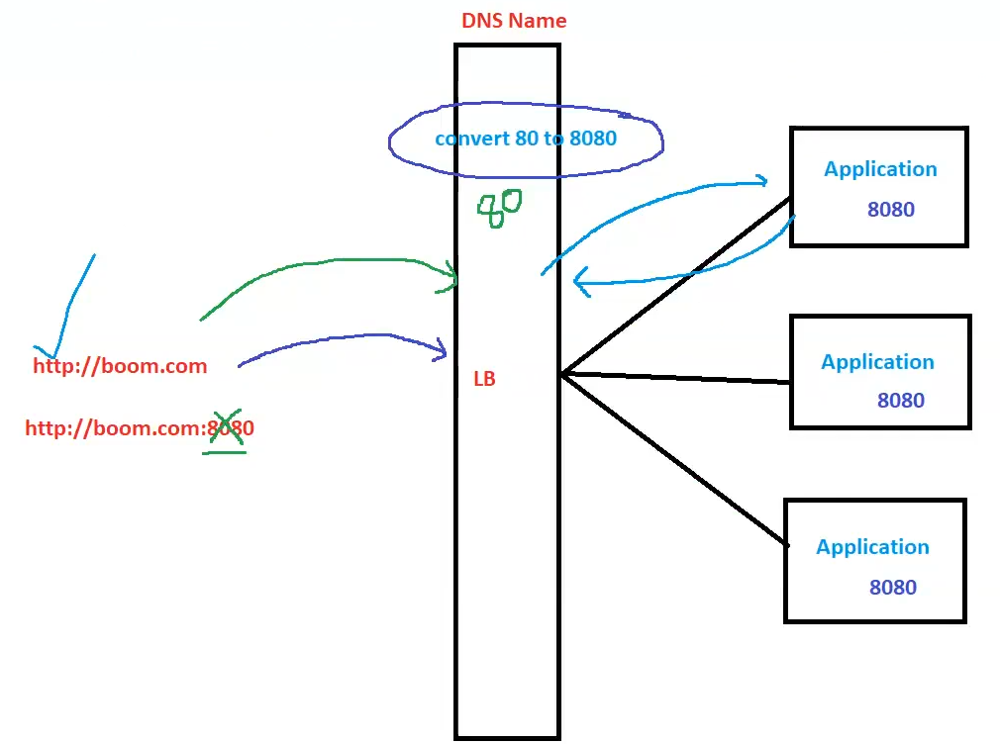

# 04. Protocols [ 14/10/2025 ]

---

## Protocol & URL

- **`protocol`** → a set of rules
    - Protocols define how data is **formatted**, **transmitted**, and **received** between Devices over the internet
- `URL` → **Uniform Resource Locator**.
    - `URL` → is a Web Address
    - URL is used to Locate the Resource on the Internet
- Syntax: `protocol://DomainName:port`
    
    

<aside>
💡

NOTE:

- WKT, `protocol://DomainName:port` is the Actual Syntax
- But we will never use Port Number in The URL, why .. ?
    - Because, WKT default port number for HTTP is 80 & HTTPS is 443
    - So, we can ignore the port number for http or https [ 80 or 443 ] protocols
    - i.e., we can mention in the URL or we don’t [ It will be auto assigned ]
- But what if the Applications uses different Port Number
    - Then we must need to enter port number in the URL
    - But still we are not entering port number in URL & it is working. How .. ?
        - Because of LB
        - LB will convert the default port numbers to application specific port numbers
    - If LB is NOT installed, then we must enter port number,
    - else connection cannot be established
</aside>

## HTTP

- HTTP → Hyper Text Transfer Protocol
- HTTP → A Protocol used to transfers the data over the Internet [ between the Devices ]
    - It defines how clients and servers communicate,
        - primarily for requesting and delivering web content such as HTML pages, images, and videos.
    - HTTP will have
        1. Methods [ GET, POST, DELETE etc.. ] → Seen in Client’s Request
        2. Status Code [ 200, 402 etc.. ] → Seen in Server’s Response
- HTTP is the foundation of Web communication between Devices
- HTTP is a **stateless**, **text-based** protocol,
    - which means each request-response cycle is independent and doesn't retain information about previous interactions.
- Default Port → `80`
- NOTE:
    - HTTPS Uses TCP to send/receive data

## HTTP (vs) HTTPS

- HTTP sends the data in plain Text format [ without Encryption ]
- HTTPS sends the data with Encryption
    - for this, we need to buy Certificates like SSL/TTL/HTTPS [  from Providers ]
    - Then, need to Install those Certificates on the LB

## TCP

- **TCP** → **Transmission Control Protocol**
- TCP is one of the core protocols of the **Internet Protocol (IP) suite**,
    - often used alongside **IP** — together called **TCP/IP**.
- `TCP` → Protocol responsible for
    1. **Establishing a Connection between Devices**
    2. **Delivery of Data between Devices [** with reliable, ordered, and error-checked ]
- TCP Key Features:
    - **Connection-Oriented**:
        - Before transmitting data, TCP establishes a connection using a process called the **three-way handshake**.
        - Ensures both sender and receiver are ready.
    - **Reliable Delivery**:
        - TCP ensures that all data is received and in the correct order.
        - If data is lost or corrupted, it will be retransmitted.
    - **Ordered Data Transfer**:
        - Data packets are numbered, so they are reassembled in the correct order.
    - **Error Detection**:
        - Uses checksums to detect errors in data transmission.

| Feature | TCP | UDP |
| --- | --- | --- |
| Type | Connection-oriented | Connectionless |
| Reliability | Reliable, guaranteed | No guarantee |
| Ordering | Ensures order | No order |
| Speed | Slower (more overhead) | Faster (less overhead) |
| Use Cases | Web, email, file transfer | Video streaming, gaming |

### In Simple Terms:

- **TCP** = The reliable delivery truck/Service
    - It makes sure your package (data) gets to the destination safely and in order.
- **HTTP** = The Delivery Item (like a letter or document) being delivered.
    - It describes **what** you're sending — like a web page request or response
    - and how it should be handled.

