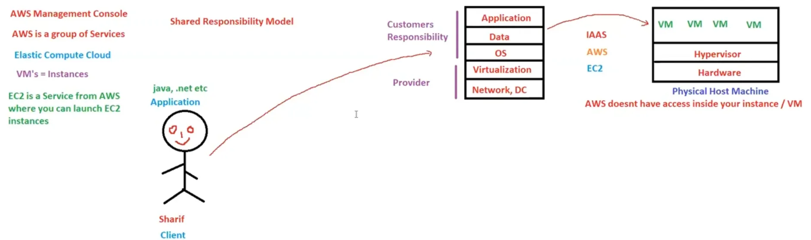

# 07. Service Models [ 23/10/2025 ]

---

- **Infrastructure as a Service (IaaS)**: Virtualized computing resources, such as servers, storage, and networking.
- **Platform as a Service (PaaS)**: A complete development and deployment environment for applications, including tools, libraries, and infrastructure.
- **Software as a Service (SaaS)**: Software applications delivered over the internet, eliminating the need for local installation and maintenance.

<aside>
💡

- WKT, AWS means “Amazon Web Services”
- AWS is Not just a single service but a Group of Services [ like EC2, VPC, ELB etc.. ]
- Hence called Amazon Web Services [ web → web of Services ]
- We can Access AWS services through AMC [ Amazon Management Console ]
</aside>

## IAAS

AWS provides Infrastructure as a Service [ IAAS ], means

- AWS will only provide the Infrastructure → Network [ based Infrastructure ], DC [ Host machines/Servers ], virtualization
- But the customer is Responsible to create the Virtual Machine himself, where
    - Installation of OS
    - Development of App & Data
    - Deployment of App
- AWS doesn’t have access to inside of these VM’s
- So, Security of the application must be taken care by the Customer
    - This is called **`shared responsibility model`**

- VM’s in AWS are known as “Instances”
- the service used to create these instances is `EC2`

`EC2 [ Elastic Compute Cloud ]` → A service provided by AWS which is used to launch/create Virtual Machines called Instances 

Here, in IAAS Customer needs to know :

- how to create EC2 instance → Creating VM [ installing OS ]
- How to develop the Application
- How to deploy the application
- Customer will have total control over the servers

## PAAS

The major drawback of IAAS is 

- Customer needs to know :
    1. how to create instance [ VM ] & 
    2. how to deploy the application

PAAS will compensate to these drawbacks by taking care of the VM with OS installation & App deployment

- Service Provider will take care of:
    - How to create EC2 instance → Creating VM [ installing OS ]
    - How to Deploy the Application
- Customer needs to know :
    - How to Develop the Application [ & it’s underlying  data ]

But customer will always depend on the PAAS provider for each & every newer version releases

- Here, Customer have NO control over the servers

Azure has started & meant for PAAS

AWS started as a IAAS, but expanded to provide PAAS as well, with the help of `Elastic Bean Stalk`

- `Elastic Bean Stalk` → A service from AWS which is used for easy & quick deployment of an application in AWS
    - This Service is responsible for achieving PAAS in AWS

## SAAS

- It will take care of developing the application as well
    - along with deployment, OS, Virtualization, Hypervisor, Server, Data Center, Network etc..
- Everything is taken care by provider only
- EX: Zoom, Notion, Gmail etc..

## SUMMARY:

- In IaaS, Customer is responsible for
    - Installation of OS
    - Development of App & Data
    - Deployment of App
- In PaaS,  Customer is responsible for
    - Development of App & Data
- In SaaS, Customer is NOT responsible for anything

---

## **Shared Responsibility Model**

**`Shared Responsibility Model`** A framework in cloud computing that divides security and compliance responsibilities between the cloud service provider (CSP) and the customer.

- This model ensures that both parties actively contribute to securing the cloud infrastructure and maintaining compliance.

**Cloud Service Provider (CSP)**:

- Securing the underlying infrastructure, including:
    - Physical security (data centers, access controls)
    - Network-infrastructure security (routers, switches, load balancers)
    - Hypervisor security
- Monitoring and responding to security threats related to the cloud itself and its underlying infrastructure

**Customer**:

- Securing cloud-hosted data and applications, including:
    - Data protection (confidentiality, integrity, availability)
    - Application security (secure coding practices, vulnerability assessments, security controls)
    - Network controls (firewalls, virtual private networks, security groups)
    - Compliance and governance (meeting regulatory requirements, implementing governance controls)

<aside>
💡 Summary

- Amazon Web Services (AWS) defines its shared responsibility model, where
    - **AWS secures the underlying infrastructure, and**
    - **customers are responsible for securing their cloud-hosted data and applications**.
- Google Cloud Platform (GCP) and Microsoft Azure also follow a similar shared responsibility model.
</aside>