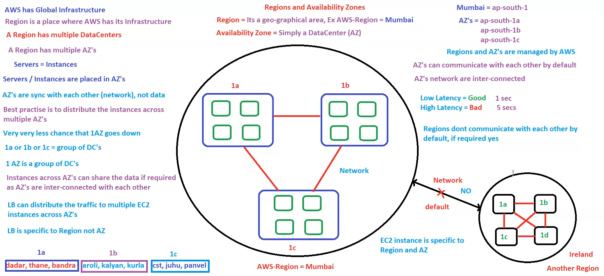

# 09. Regions & Availability Zone’s [ 24/10/2025 ]

---

## Region

WKT, AWS has it’s Infrastructure Globally → i.e., AWS has Global Infrastructure

- `Region` → The place (or) Geographical area where the AWS infrastructure is located
- A Region has multiple data centers [ cuzz, if one goes down another can back it up ]
- Default Region is `North-Virginia`

## Availability Zone

- `Availability Zone` → Group of Data Centers [ spread across multiple areas ]
    - Hence, an AZ cannot go down [ Since each DC is located in multiple areas & all of them together is a single AZ ]
- So we can say → A region has multiple Availability Zones
    - WKT, Servers == Instance
    - Since these instances are launched inside the data centers → We can say, Instances are placed in AZ’s
- Regions & AZ’s are Managed by AWS

In India, we have 2 Regions → Mumbai & Hyderabad 

- Since Hyderabad is newly established, all the services are NOT available as of now. Hence we will focus on Mumbai
- Region code of Mumbai → `ap-south-1` [ Asian pacific south 1]
- We have 3 AZ’s in Mumbai → `ap-south-1a` , `ap-south-1b` & `ap-south-1c`
    - These Individual AZ’s are inter-connected with each other by default
    - Hence By Default, they can communicate with each other
- Hence, The instances launched using AMC [ Amazon Management Console ] which resides inside these AZ’s can also communicate with other instances placed across multiple AZ’s
    - i.e., Instances across multiple AZ’s can communicate & share data with each other
    - But by default, the Data across these multiple Instances are NOT in sync
        - They can only connect, communicate with each other using the Network
        - Since they are connected & can communicate → They can also share data
        - As they can share Data, hence Data can be Synced [ if required ]
- Hence, EC2 Instance is Specific to Region & AZ [ NOT Global Service ]

Since, LB distributes the traffic to multiple instances, But instances are across multiple AZ’s 

- i.e., why LB is NOT specific to 1 AZ
- Hence LB are installed at Region level & is inter-connected with multiple AZ’s to distribute the traffic to every instance
- i.e., why `LB` → Which Distributes the incoming Requests/Traffic to Multiple EC2 instances across AZ’s

But, By Default,  Regions are NOT inter-connected with each other & Cannot Communicate

- If required, then we can connect 2 regions

NOTE:

- WKT, Each AZ will have Multiple Data Centers
    - These Data Centers will be 100kms apart from each other
    - And these Data Centers are NOT publicly disclosed
- t is recommended to spread/distribute the EC2 instances across multiple AZ’s
    - so that if 1 AZ’s goes down, others can handle the requests
    - These Instances are only connected with Network for Communication,
    - But Data is NOT in Sync across these instances [ This can be in Sync based on requirement ]
- Based on the Customer’s Region/Requirement, we will launch the Instances in the Respective Regions
    - This is to Ensure Low Latency
- EC2 is a Regional Service [ NOT a Global Service ]
- ELB is a Regional Service [ NOT a Global Service ]
- `LB` → Which Distributes the incoming Requests/Traffic to Multiple EC2 instances across AZ’s

## VPC

Until now, we assumed AZ’s are within Region & Regions are within AWS

- AWS is public cloud, and
- Each AZ is inter-connected withe each other & can communicate withe each other

But lets say, we have 4 customer & each customer has instances across multiple AZ’s

- Now, will the instances from a single customer across AZ’s communicate with other customer’s instances across AZ’s..?
- Is this allowed..?
- Ans → NO, this is NOT allowed as this leads to privacy issues

Even though AWS is public cloud & AZ’s can communicate with each other, we shouldn’t allow the above case

- Hence, each customer needs a private cloud among/within this public cloud AWS
- Here comes another service called `Virtual Private Cloud [ VPC ]`
    - VPC is spanned across multiple AZ’s
    - instances across VPC cannot communicate with each other
        - i.e., Two VPC’s cannot communicate with each other by default
        - But we can make 2 VPC’s to communicate with each other
    - This VPC layer will come between Region & AZ
- Customer needs to setup/implement this VPC which is provided by AWS as one of the security feature
- AWS won’t provide VPC by default

<aside>
💡

NOTE:

---

- Only 5 VPC’s as are allowed per Region
- By Default, 2 VPC’s cannot communicate with each other [ but, we can make it happen ]
    - Hence, Instances across multiple VPC’s cannot communicate with each other
- Every Region will have a default VPC
    - But  by default, AWS won’t provide this default VPC, we need to configure
</aside>

This shows AWS models with multiple AZ’s 

A min of 2 AZ’s are required for Fault Tolerance

In the beside figure,

- Black lined box represents “Region”
- yellow dotted box represents “AZ”
- Orange block → instance
- Orange block with container & curved edges → DB

Form the beside fig, we can say

- Top Region is NOT highly available → As it fails in redundancy
- Bottom Region is HA → As it has redundancy, Fail-over & Monitoring [ as there is LB, monitoring will be done ]

