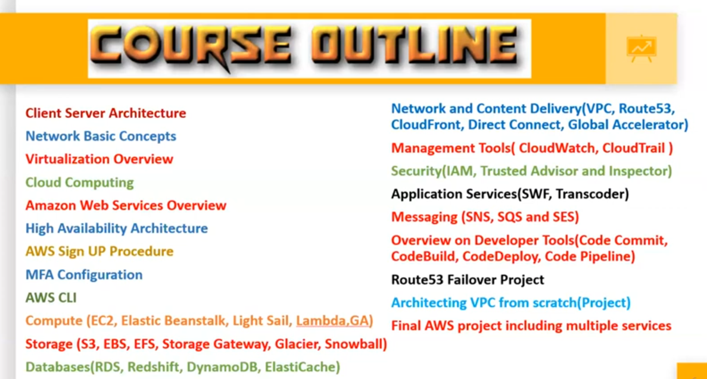

# 01. Intro [ 31/03/2025 ]

---

## Course Overview

- Client Server Architecture
- Network Basic Concepts
- Virtualization Overview
- Cloud Computing
- Amazon Web Services Overview
- High Availability Architecture
- AWS Sign UP Procedure
- MFA Configuration
- AWS CLI
- Compute (EC2, Elastic Beanstalk, Light Sail, Lambda, GA)
- Storage (S3, EBS, EFS, Storage Gateway, Glacier, Snowball)
- Databases(RDS, Redshift, DynamoDB, ElastiCache)

- Network and Content Delivery(VPC, Route53,
- CloudFront, Direct Connect, Global Accelerator)
- Management Tools( CloudWatch, CloudTrail )
- Security(IAM, Trusted Advisor and Inspector)
- Application Services(SWF, Transcoder)
- Messaging (SNS, SQS and SES)
- Overview on Developer Tools(Code Commit,
- CodeBuild, CodeDeploy, Code Pipeline)
- Route53 Failover Project
- Architecting VPC from scratch(Project)
- Final AWS project including multiple services

## Why to Choose AWS..?

- AWS -Fastest Growing Public Cloud in the World
- AWS is the leader in the Cloud Computing market.
- Increased “Enterprise Cloud Migration” to AWS
- Affordable Pricing and Access to Free Tier for Learning AWS
- AWS is Quickly Becoming the Gold Standard of the Cloud
- AWS is used by Many of the Major Businesses [ like Network ]
- AWS Skills are High in Demand & Pays more Money

## AWS Certifications

## Are Certifications Mandatory..?

- NO
- But, It is Highly Recommended
- The Industry is in Dearth/Scarce of AWS Experts
- We will be Targeting the “AWS Certified Solutions Architect - Associate”
    - We will be learning at Architect level
    - If Developer faces issue at Infrastructure level, he will approach Admin
    - If Admin faces issue at Infrastructure level, he will approach Architect
    - Architect is the ONE who knows everything about the Infrastructure

<aside>
💡

NOTE:

---

- AWS is a Big Umbrella, under which Development, Operations & DevOps will be carried over
</aside>