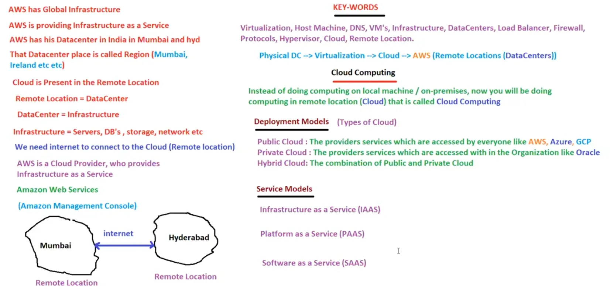

# 05. Infrastructure [ 03/04/2025 ]

---

<aside>
💡

- `Infrastructure` → refers to both hardware & software components that helps us to create, manage, and operate software applications.
- `Data Centers` → Group of Servers located in a single place which comprises of IT equipment and infrastructure
    - A facility that houses an organization's IT equipment and infrastructure
    - Hence, we can refer Data Centers as Infrastructure
</aside>

WKT, Cloud Technology will handle the Data Centers. One of the Company who offers this cloud is Amazon & it’s name is AWS

- AWS → Amazon Web Services
- AWS offers Infrastructure as a Service → `IAAS`
- AWS has Data Centers Globally [ In India, It has in Mumbai & Hyderabad ] → Global Infrastructure
- These AWS Data Centers are NOT present on-premises of each company but in Remote places
- The place where the Data Center is located is called `Region`
- AWS provides these service of Data Center from these Remote places called Regions over the Internet→ Hence called `Cloud`
- Hence, `AWS` → is a Public cloud provider who provides Infrastructure as a Service over the Internet
- `Amazon management Console [ AMC ]`→ A web-based application that provides centralized access to all Amazon Web Services (AWS).
    - It serves as a single entry point for managing AWS resources,
    - It enables the Clients to Configure & Manage the AWS resources remotely

<aside>
💡 Cloud || Cloud Service → Delivering any Service over the Internet that can be accessed from a remote location

</aside>

## Cloud Technology || Cloud Computing

- Instead of doing computing on a local machines on-premises, we will be doing the computing on remote machines present in a remote location → cloud computing

Cloud technology, [ aka cloud computing ] is **a model of delivering on-demand computing resources and services over the internet**, 

- eliminating the need for individuals and businesses to manage physical infrastructure and resources themselves.
- It provides scalable, flexible, and on-demand access to a shared pool of computing resources, including:
    - **Infrastructure as a Service (IaaS)**: Virtualized computing resources, such as servers, storage, and networking.
    - **Platform as a Service (PaaS)**: A complete development and deployment environment for applications, including tools, libraries, and infrastructure.
    - **Software as a Service (SaaS)**: Software applications delivered over the internet, eliminating the need for local installation and maintenance.

**Key Characteristics**

1. **On-demand self-service**: Users can provision and de-provision resources as needed, without requiring human intervention.
2. **Broad network access**: Resources are accessible over the internet or a private network.
3. **Resource pooling**: Computing resources are pooled together to provide a multi-tenant environment.
4. **Rapid elasticity**: Resources can be quickly scaled up or down to match changing business needs.
5. **Measured service**: Users only pay for the resources they use, with pricing based on usage metrics.

**Benefits**

1. **Scalability**: Easily scale up or down to match changing business needs.
2. **Cost-effectiveness**: Reduce capital and operational expenses by outsourcing infrastructure and maintenance.
3. **Increased agility**: Quickly deploy new applications and services, without lengthy procurement and setup processes.
4. **Improved collaboration**: Access to shared resources and applications enables greater collaboration and teamwork.
5. **Enhanced security**: Cloud providers typically offer robust security measures, including encryption, firewalls, and access controls.

**In summary**, cloud technology is a computing model that enables on-demand access to shared, scalable, and flexible resources over the internet, providing a cost-effective, agile, and secure way to deploy and manage applications and services.

## Deployment Models [ Types of Cloud ]

- Deployment models are also known as `Types of Cloud`
    - `public cloud` → Services [ cloud provider services ] which are accessible by everyone [ like AWS, Azure, GCP ]
    - `private cloud` → Services which are accessible by people within organization [ like Oracle ]
    - `hybrid cloud` → Combination of Public & Private Cloud
        - It is just a model where Sensible & confidential transactions are done privately on-premises & remaining are done using public cloud.

## Service Models

- Service models are nothing but types of services [ provided by the cloud provider ]
    - `Infrastructure as a Service [ IAAS ]` → Providing Infrastructure as a Service is called IAAS ❌ [ This is NOT the correct ans ]
    - `Platform as a Service [ PAAS ]` → Providing Platform as a Service is called PAAS ❌ [ This is NOT the correct ans ]
    - `Software as a Service [ SAAS ]` → Providing Software as a Service is called SAAS ❌ [ This is NOT the correct ans ]

<aside>
💡

NOTE:

---

- **Infrastructure as a Service (IaaS)**: Virtualized computing resources, such as servers, storage, and networking.
- **Platform as a Service (PaaS)**: A complete development and deployment environment for applications, including tools, libraries, and infrastructure.
- **Software as a Service (SaaS)**: Software applications delivered over the internet, eliminating the need for local installation and maintenance.
</aside>

