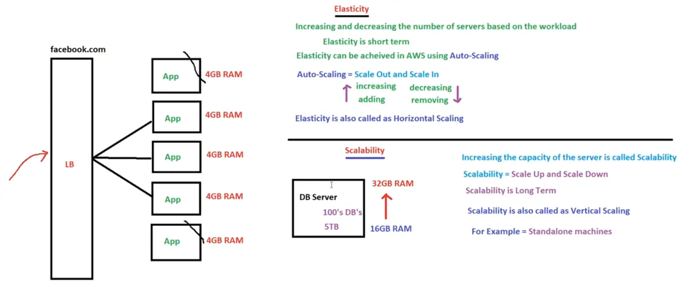

# 07. Elasticity, Scalability & Availability ( 3T’s ) [ 03/04/2025 ]

---

## Elasticity

- `Elasticity` → Increasing & decreasing the No of servers based on workload
- Elasticity can be achieved in AWS using `Auto-Scaling`
- Auto-Scaling → Scale Out [ Increasing No of Servers ] & Scale In [ Decreasing No of servers ]
- Elasticity is also known as `Horizantal-Scaling`
- Elasticity is short term
- This Elasticity is seen during Big Billion Day sales where No of servers will be increased for just 2 days

## Scalability

- `Scalability` → Increasing the capacity of the Server [ like from 16GB RAM to 32GB RAM ]
    - ex: Standalone Servers like DB servers
        - Where, DB Server is very largely configured like 10TB & 16GB [ due to large data & high performance ]
        - Hence, increasing the NO. of DB servers is NOT a good idea [ due to replication & cost ]
            - But, we will have multiple DB Servers & Separate LB pointing to DB’s [ ⇒ Multiple LB’s ] to achieve High Availability
- Scalability → Scale Up & Scale Down
- Scalability is also known as `Vertical Scaling`
- It requires Downtime
- This scalability is majorly seen in standalone servers
- Scalability is Long Term

## High Availability

- `High Availability` → The period of time for which the service is available to the customer
- The period of time for which the service is NOT available to the customer is called `Downtime`
- HA is always measured in percentage [ % ]

Let’s say, we have a customer “Akshay”, who have an application But reached us to deploy it & give him the URL

- We deployed the app in a server & it’s IP address of server is `192.168.10.20` & given hime URL as → http://192.168.10.20/index.html
- It is working fine for some time & then suddenly URL crashed → URL is NOT working
- Then we have deployed the same app in multiple servers & gave him those 3 URL’s, So when 1 fails he can use other 2 URL’s [ Redundancy ]
- Hence, We have introduced a LB to distribute the incoming traffic to these 3 servers
- But remembering these 3 URL’s is difficult & hence gave him a domain name which is assigned to LB → http://akshay.com

To achieve HA we require 3 things `RMF`

- `Redundancy` → Duplicate || same || copy || repeating → keeping/hosting the same application on multiple servers
- `Monitoring` → Checking the Application is reachable or not
    - LB will always monitor using health checks of application
    - How does LB know that the application is down..?
        - It will monitor continuously with specified interval of time with the help of health checks [ i.e., through status codes like 200 ]
    - NOTE → LB will monitor [ the health checks of ] Application but NOT the server
        - Because, If we monitor the application we will be monitoring server too, as App will lie inside the server
- `Failover` → redirecting the incoming requests to available server, when one of the server goes down
    - If One Server goes down, Other Server will take the request

But what if all the servers goes down → then HA is NOT achieved

- Hence, To achieve 100% HA → we will implement `auto-scaling` on top of RMF
- i.e., Zero Downtime is achieved using auto-scaling on top of RMF, which is also known as `Fault Tolerance` → Achieving Zero Downtime

In this way, we need to implement architecture in such a way that,

Even if half of the infrastructure is down, application (or) customer should NOT be impacted → 100% HA