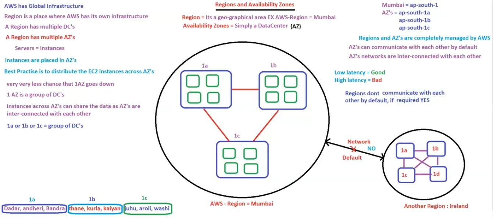

# 08. Regions & Availability Zone’s [ 03/04/2025 ]

---

WKT, AWS has it’s Infrastructure Globally → Global Infrastructure

- `Region` → The place (or) Geographical area where the AWS infrastructure is located
- A Region has multiple data centers [ cuzz, if one goes down another can back it up ]
- `Availability Zone` → Group of Data Centers [ spread across multiple areas ]
    - Hence, an AZ cannot go down [ Since each DC is located in multiple areas & all of them together is a single AZ ]
- So we can say → A region has multiple Availability Zones
    - WKT, Servers == Instance
    - Since these instances are launched inside the data centers → Instances are placed in AZ’s

In India, we have 2 Regions → Mumbai & Hyderabad 

- Since Hyderabad is newly established, all the services are NOT available as of now. Hence we will focus on Mumbai
- Region code of Mumbai → `ap-south-1` [ Asian pacific south 1]
- We have 3 AZ’s in Mumbai → `ap-south-1a` , `ap-south-1b` & `ap-south-1c`
    - These Individual AZ’s are inter-connected with each other by default
    - Hence By Default, they can communicate with each other
- Hence, The instances launched using AMC [ Amazon Management Console ] which resides inside these AZ’s can also communicate with other instances placed across multiple AZ’s
    - i.e., Instances across multiple AZ’s can communicate & share data
- Since, LB distributes the traffic to multiple instances, But instances are across multiple AZ’s
    - i.e., why LB is NOT specific to 1 AZ
    - Hence LB are installed at Region level & is inter-connected with multiple AZ’s to distribute the traffic to every instance
- But, By Default,  Regions are NOT inter-connected with each other & Cannot Communicate
    - If required, then we can connect 2 regions

<aside>
💡

NOTE:

---

These Regions & AZ’s are completely managed by AWS
It is recommended to spread/distribute the EC2 instances across multiple AZ’s [ so that if 1 AZ’s goes down others can handle the requests ]

</aside>

In the above figure,

- Black lined box represents “Region”
- yellow dotted box represents “AZ”
- Orange block → instance
- Orange block with container & curved edges → DB

Form the above fig, we can say

- Top Region is NOT highly available → As it fails in redundancy
- Bottom Region is HA → As it has redundancy, Fail-over & Monitoring [ as there is LB, monitoring will be done ]

## VPC

Until now, we assumed AZ’s are within Region & Regions are within AWS

- AWS is public cloud, and
- Each AZ is inter-connected withe each other & can communicate withe each other

But lets say, we have 4 customer & each customer has instances across multiple AZ’s

- Now, will the instances from a single customer across AZ’s communicate with other customer’s instances across AZ’s..?
- Is this allowed..?
- Ans → NO, this is NOT allowed as this leads to privacy issues
- Even though AWS is public cloud & AZ’s can communicate with each other, we shouldn’t allow the above case
- Hence, each customer needs a private cloud among/within this public cloud AWS
- Here comes another service called `Virtual Private Cloud [ VPC ]`
    - VPC is spanned across multiple AZ’s
    - instances across VPC cannot communicate with each other
        - i.e., Two VPC’s cannot communicate with each other by default
        - But we can make 2 VPC’s to communicate with each other
    - This VPC layer will come between Region & AZ
- Customer needs to setup/implement this VPC which is provided by AWS as one of the security feature
- AWS won’t provide VPC by default

<aside>
💡

NOTE:

---

- Only 5 VPC’s as are allowed per Region
- By Default, 2 VPC’s cannot communicate with each other [ but, we can make it happen ]
    - Hence, Instances across multiple VPC’s cannot communicate with each other
- AWS won’t provide VPC by default
</aside>

We can make HA with 1, 2 or 3 AZ’s also

- here is the HA achieved using 3 AZ’s

