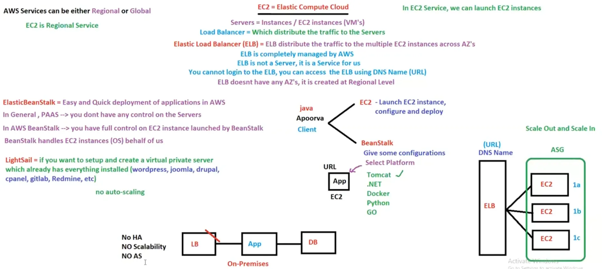

# 09. Overview of AWS Services [ 03/04/2025 ]

---

<aside>
💡

NOTE:

---

- AWS services can be either Global (or) Regional
    - EC2 is Regional
    - Mostly all Services are Regions, Very Few are Global
</aside>

## EC2

- EC2 is a Service provided by AWS which is used to Launch VM’s [ EC2 Instances ]
- EC2 service is a Regional Service
    - i.e., instance created in Mumbai is only available in Mumbai but NOT in Sydney

## Elastic Load Balancer [ ELB ]

- WKT, LB distributes the incoming traffic to multiples servers
- So, It may go down if it is maintained by us on-premises
- Hence, AWS offers LB as a Service but NOT as a server
- As AWS offers LB as a service, It shouldn’t go down & will never go down
    - i.e., why, LB offered by AWS is called ELB
    - Whenever a ELB is created, AWS will generate an URL with domain name

`ELB` → distributes the traffic to multiple EC2 instances across AZ’s

- ELB is completely managed by AWS
- ELB is a Service [ NOT a server ]
- We cannot login to ELB, we can only access ELB using Domain Name URL
- ELB doesn’t have AZ’s, It is created at Regional Level → ELB is Regional

## Elastic Bean Stalk [ EBS ]

- `EBS` → Is a service provided by AWS for quick & easy deployment of applications in AWS
    - EBS will launch EC2 instances automatically, configure those & deploy app in those instances
    - EBS handles EC2 instances [ OS ] on behalf of clients
    - Hence, EC2 is the backbone of EBS
- In General, EBS comes under `PAAS`, where customer doesn’t have control over servers/EC2 Instances
    - But in AWS EBS, customers will also have full control over the EC2 instances launched by EBS
    - But it is NOT recommended

<aside>
💡 We have 2 ways to deploy an Application in AWS

- EC2 → We need to manually launch instances, configure it & then deploy application ⇒ Manual
- EBS → we just need to give some configurations, IT will automate the launch of instances, configuring it & deploying ⇒ Automation
</aside>

## LightSail

- In LightSail, AWS provides us with pre-defined Servers with Applications
- `Lightsail` → A service from AWS used to setup & create Virtual Private Server [ VPS ] where everything is installed [ It is like a SAAS ]
    - like compute power, storage, memory, networking capacity & even applications as well
- i.e., Even the application is given as a service by AWS in LightSail [ In EBS, customer need to provide the application ]
- It doesn’t support `Auto-Scaling`
    - Hence, It is NOT recommended for production
    - It is used for smaller use cases (or) smaller customers (or) by individuals
- LightSail is Regional

<aside>
💡

NOTE:

---

- For each & every Event performed/triggered in the AWS, will be stored in a place called “Event Bridge”
- `Event Bridge` → A Place where all the Triggered Events are Stored
</aside>

## Lambda

- `Lambda` → lets us write/create functions called Lambda Functions
    - We can write functions in multiple languages → Lambda supports multiple Languages
    - With these functions, we can automate tasks
- Hence, Lambda is used for Automation
    - All the Events are stored in a single place called `Event Bridge`
    - With the help of these events, we can write functions to automate
- Lambda is Server-less [ but behind the scenes Lambda uses servers to run ]
    - In case of server [ means ] → User need to login to connect to server & then use it
    - In case of server-less [means ] → user don’t need to login to connect
- Lamba is Regional

