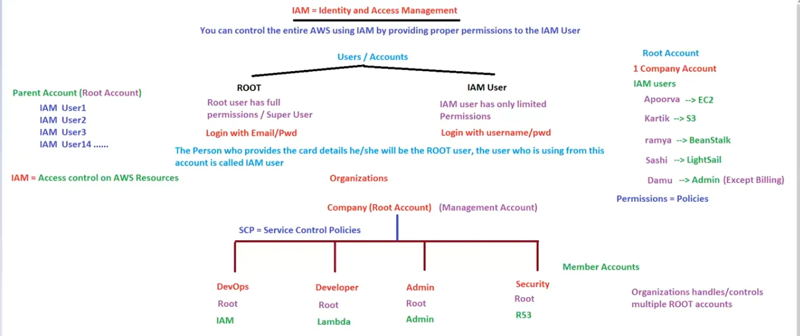

# 13. IAM [ 05/04/2025 ]

---

## Identity & Access Management [ IAM ]

We have 2 types of Users/Accounts 

1. Root → 
    - Root user will have full permissions [ Default ]
    - This is the default User
    - Need to login using email
2. IAM → 
    - IAM users will have only limited permissions
    - Root user needs to create IAM users
    - Need to login using username & password
    - `IAM` → Used to provide Access Control (or) Controlled Access over the AWS resources

We can control the entire AWS by providing the proper permissions/Policies to IAM user

## Organizations

- `Organisation` → Used to manage/control multiple Root Accounts
    - The main Root account which foresee the other Root accounts is called Management Account
    - The other Root accounts below management account is called Member Accounts
    - The Management Account can control the permissions/policies of member accounts using `SCP` [ Service Control Policy ]
    - Member Account can control the permissions of the IAM users

## Cloud Watch

- `Cloud Watch` → Used to monitor all the AWS services & it’s associated metrics [ like CPU, RAM, Network.. ]
- Cloud Watch will have a service called `Alarm` which is used to send Notifications when any metric reaches it’s threshold value
    - i.e., Cloud Watch is Service, where we will create Alarms to monitor AWS services [ Similar to CloudFront is a Service where we will create Distributions ]
    - In this way, Cloud Watch will monitor Performance, Applications etc..
    - Alarm will use `SNS` service to send the notification in the form of email/SMS
- There are 2 types of Monitoring
    - Basic Monitoring → Will get data points every 5 mins [ Free & Default monitoring ]
    - Detailed Monitoring → Will get data points every 1 min [ Billable ]
- In Cloud Watch, we can Monitor Applications as well

## Cloud Trail

- `CloudTrail` → A service provided by AWS, which helps you track, monitor, and log activities across your AWS account.
    - Essentially, it records and stores a history of all API calls, events, and actions taken by users, roles, or AWS services within your environment.
    - This includes who performed an action, when they did it, and what resources were affected
- CloudTrail is invaluable for auditing, security analysis, and troubleshooting
- The logs can be sent to Amazon S3 for storage,
    - and you can analyze them using tools like Amazon CloudWatch or AWS Athena for deeper insights

<aside>
💡 `Cloud Trail` → Records & Stores entire AWS services within your environment
→ It is similar to Event Logger/Viewer in Windows machine
→ Every thing is recorded here [ It records, monitors, tracks, audits, logs etc.. ]

`Config` → Monitor the ***changes*** in AWS resources
→ this is also done by `Cloud Trail` , But finding these in that is difficult, Hence config is developed

`AWS Inspector` , `Trusted Advisor` & many are security related services

</aside>

`AWS Support` → 

- There are multiple types of support provided by AWS
    - Basic Support [ Free ]
    - Developer Support
    - Business Support
    - Enterprise Support

## What is the difference between Root User & IAM Admin User..?

- Billing

## Difference between Cloud Trail & Event Bridge..?

- In Short:
    - Use `Cloud Trail` if your focus is on security, compliance, or troubleshooting by logging API activity.
    - Use `Event Bridge` to create event-driven architectures that respond to specific events in near real time.

