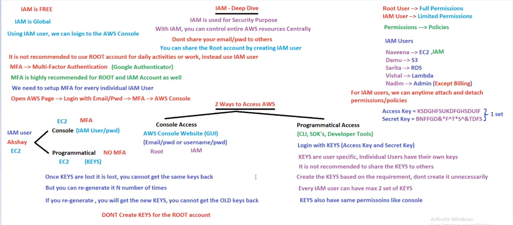

# 14. IAM Users [ 07/04/2025 ]

---

## Identity & Access Management [ IAM ]

We have 2 types of Users/Accounts 

1. Root → 
    - Root user will have full permissions [ Default ]
    - This is the default User
    - Need to login using email
2. IAM → 
    - IAM users will have only limited permissions
    - Root user & User who have access [ like Admin ] can Create IAM users
    - Need to login using username & password

`IAM` → Used to provide Access Control (or) Controlled Access over the AWS resources

We can control the entire AWS by providing the proper permissions/policies to IAM user

- IAM is used for Security Purpose/feature
    - Root User → Full Permissions
    - IAM User → Limited Permissions
        - For IAM Users, we can add/remove permissions/policies anytime
        - One IAM user can have multiple policies
- With IAM, we can control the entire AWS resources Centrally
- IAM is Global & Free [ S3 & Route 53 as well ]
    - `Global` → Once Created in a Region, Available in all Regions
    - `Regional` → Once Created in a Region, Available only to that Specific Region
- With IAM (or) Root credentials we can only login to AWS console but NOT the Servers [ EC2 instance (or) DB instance etc.. ]
- We shouldn’t share our Root Account credential,
    - Instead we need to create a IAM user & share those credentials
- We need to setup MFA for every individual IAM accounts

<aside>
💡

NOTE:

---

- It is NOT recommended to use Root Account for daily activities, [ Email & pwd ]
- It is Recommended to use IAM Account for daily activities [ Username & pwd ]
- For Both Root & all IAM Accounts, MFA [ Multi Factor Authentication ] is highly recommended  for Better Security
    - i.e., we need to setup MFA for every individual Account [ it may be Root or IAM Users ]
</aside>

There are 2 ways to Access AWS

- Console Access
    - Using AWS website [ GUI ] through Root & IAM users
        - We can login via email/username & pwd
        - We have MFA in this console way access
- Programmatic Access
    - Using Programming languages through CLI, SDK’s, Developer Tools, 3rd Party Apps etc..
        - Here, we can login using keys [ Access Key & Secret Key ]
            - These Keys are User Specific & is NOT recommended to share these keys
                - And will have the same Permissions/Policies as the User → User Specific Permissions
            - Once Key is Created, We need to Download the Key. As We can’t Access the Secret Key later
                - Secret Key will only be visible once, after that we can’t access it → Hence we need to download the keys
            - Keys are NOT mandatory to create, Hence create keys based on requirement
            - Every IAM user can have 2 set of keys [ for spare purpose ] & it is NOT mandatory too [ to have both set of Keys ]
            - Keys also have same permissions like console way
            - Once Keys are lost, we need to regenerate keys by delete OLD ones & create NEW ones [ New ones & Old ones will never be same ]
                - We can re-generate keys any number of times
            - It is NOT recommended to create Keys for Root Account, as we will be using IAM users [ Since Root account is NOT recommended for daily activities ]
        - We have NO MFA for this programmatic way of access to AWS

<aside>
💡

Summary:

- We can login to AWS using
    1. Console → IAM User name & Password
        - Root User & IAM User who has Access to IAM can Create IAM Users
        - Has MFA
    2. CLI → IAM Keys [ Access & Secret Keys ]
        - **IAM users, IAM Identity Center, and the AWS Root user** can create IAM keys.
        - IAM roles do not have this capability.
        - NO MFA
- Here, in Both Ways we will be using the IAM User only [ As Root User is NOT recommended ] but the way we login is different
- Hence, Both ways [ Console way & CLI way ] will have same permissions [ → which are User Specific ]

Best Practice is to rotate the password & keys for every 3 months [ based on the company policies ]

</aside>

