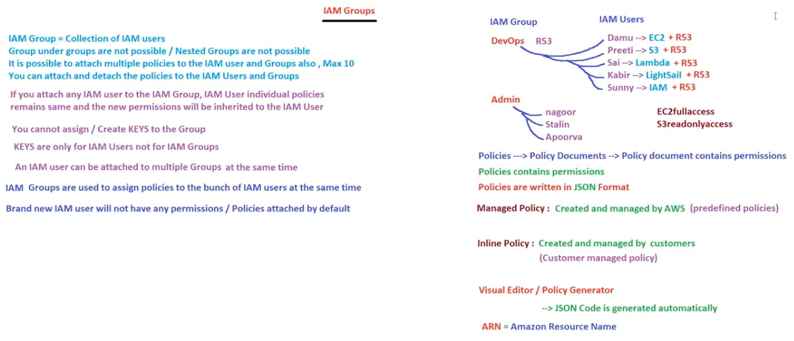

# 15. IAM Groups & Roles [ 08/04/2025 ]

---

- `IAM Group` → Collection of IAM Users
- `IAM Groups` are used to add/assign policies to multiple IAM Users at a time
    - Brand new IAM Users will NOT have any default permissions & IAM Group
    - Nested Groups [ Group under another Group ] are NOT Possible
    - We can add/attach & detach multiple policies to an IAM Group [ similar to IAM User ] → Max Policies = 10
    - If we attach any IAM User to the IAM Group, IAM user will still have their own policies & Group policies will be inherited
    - one IAM user can be attached to multiple IAM Groups
    - We cannot add/assign keys (or) MFA to Group [ Since keys & MFA are User specific ]

<aside>
💡

NOTE:

---

- IN AWS, we have Soft Limit → Limit for everything [ like creating No. of IAM Users ]
- If we need to Increase the Soft Limit, we need to ask AWS people
</aside>

WKT, Permissions == Policies in IAM User

- Similarly, Policies == Policy Documents
- Policy Document contains Permissions =⇒ Policies contains Permissions
- Policies are written in JSON format [ But We don’t need to Learn JSON ]

<aside>
💡

`Visual Editor || Plocy Generator` → Automatic JSON code/file generator for policy document

`ARN` → Amazon Resource Name [ NOT Number ]→ Used to Identify any AWS Resource [ Particularly policy document ]

</aside>

There are 2 Types of Policies

- Managed Policies
    - These are created & managed by AWS
    - These are predefined policies
- Inline Policies
    - These are created & managed by customers → customer managed policy
    - These are custom policies

## IAM Roles

- `Role` → Temporary Access to AWS without credentials
- Let’s say, We have an Linux EC2 instance → We can access only through CLI → we need to configure keys
    - If we configure keys in an Linux EC2 instance using AWS CLI to access AWS Services, then Keys will be stored locally in the EC2 instance
        - Hence, They can be accessed if anyone login to that specific EC2 instance
        - So Not Recommended
    - And If we don’t configure the Keys, we are NOT able to login to AWS & access AWS Services
    - It is a deadlock → What to do then..?
    - In these scenario, Roles are used to login without credentials & access the AWS services like EC2, S3..
- If you use the Role, we don’t need to configure the keys on the EC2 instance
- Based on the permissions/policies that are attached to the Role, Those permissions/Services are available for that EC2 instance
- ONE EC2 instance can have Only ONE Role, But One Role can be attached to multiple EC2 instances
- ex:
    - our java application needs to access the S3 service, but if we use users, we need to create keys & it will be stored in java application
    - Hence, we use role where we attach the S3 service policy & can be accessed without Auth

## Identity Provider || Federation || IAM Identity Center

Let’s say, we have 1000’s of desktop in a company → 1000’s of users will be there

- Here, each user can login to any desktop he want & do work
- is that means, those all 1000 users are created in each desktop..?
- NO → All the users will be created in an Active Directory (or) Domain Controller
- All those 1000’s desktops are now connected to this Active Directory
- It uses protocol called LDAP || OAuth || okta
- This Active Directory in AWS is called `Directory Service`

Similar to this how any user is able to login to multiple desktops,

We can login to multiple services, websites etc.. using a method called SSO [ Single Sign On ]

- Like how we used to login to YouTube, Gmail, Linked, Notion & all using a single Gmail account
- Similarly, we will be able to login to multiple AWS services using SSO
- This SSO is provided by `Ferderation`
    - `Federation` → used for Signing-in multiple services using SSO
    - `Organisation` → Used for creating multiple Root Users

