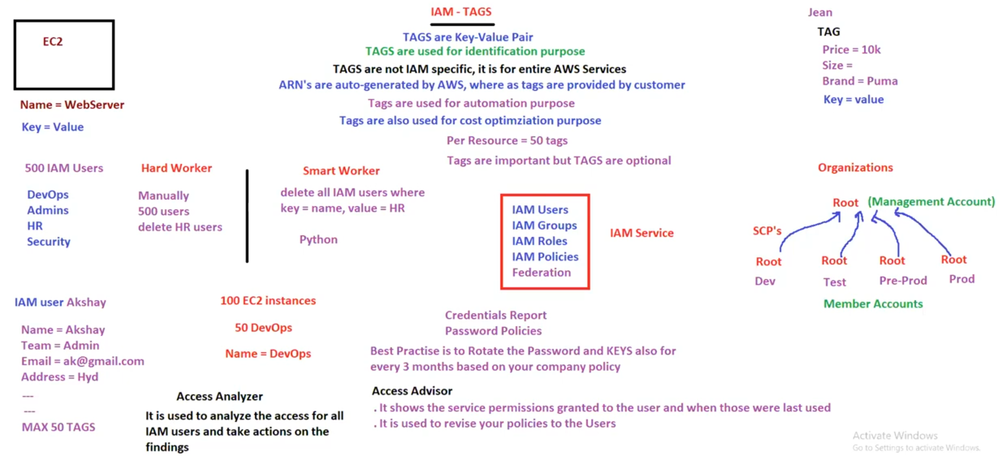

# 16. IAM Tags [ 08/04/2025 ]

---

## TAGS

- `Tags` are key-value pairs used to identify/segregate the AWS resource
    - `ARN` is mainly used in policy document
        - It is like bar-code which contains full details
        - ARN’s are auto generated by AWS
- Tags are generated/created by customers
- Tags are NOT IAM specific → It is for entire AWS → Tags can be given to any AWS service
- Tags are used for Automation purpose [ by using key-value pairs ]
- For a single AWS resource, A max of 50 Tags can be assigned/given
- Tags are Optional, but it is recommended

## Miscellaneous IAM services

- `Access Advisor`
    - It shows the services that the user has access to & when those were last accessed by user [
    - It is Used for Audit purpose in IAM User
    - It is also used to revise the policies of an User
- `Access Analyser`
    - It is used to analyze the access to all IAM users & suggest the actions based on those findings
- `Credential Report`
    - A credentials report is a downloadable file that lists all IAM users in your AWS account
    - and provides details about their credentials, such as:
        - Password status (enabled or disabled).
        - Last password usage.
        - Access keys and their status.
        - Multi-factor authentication (MFA) devices.
    - use this report for auditing and compliance purposes, ensuring that credentials are managed securely
- `Password Policies`
    - Password policies enforce rules for IAM user passwords,
    - including:
        - Password policies enforce rules for IAM user passwords, including:
        - Password expiration periods.
        - Restrictions on reusing old passwords.
        - Combining strong passwords with multi-factor authentication (MFA) for enhanced security.

## Organizations

- `Organization` → It is a Root Account, Used to Centrally Manage the Multiple Root accounts under this main Root Account
    - The main Root Account is called Management Account
    - And the Root Accounts under Management Account is called Member Accounts
- **Service Control Policies (SCPs) →** Limit permissions for IAM users and roles within AWS Organizations.

## Switch ROLE

- How to give access to people who are outside organization
- It is using switch ROLE
- ex:
    - We have an AWS Account
        - Each AWS account is identified using Account ID, which is a 12 digit number
        - Remembering this 12 digit ID is difficult, Hence we can give an alias called Account Name to the Account ID
    - Now, a person from outside organization named Vishal require to access the S3 bucket
    - creating an IAM User & give it the S3 policy is NOT recommended as he is from outside organization
    - Hence, we will create a ROLE called Vishal Role & assign some policies
        - in the policy, It will ask for Account ID, we need to give Vishal’s AWS ID
    - Now, An URL will be generated after creating the Role which is valid for only 1 hr. by default [ can be changed ]
    - Now Vishal can access the S3 bucket
    - Another way is from Switch Role → select the Account Name of the Account where service is present & Role Name

<aside>
💡

NOTE:

---

- IT is recommended to use In-Line Policy for ROLES instead of Managed Policies for outside people/organization
- Why..?
    - Because, Managed Policies will have full Access yo Services
    - Inline can be made custom according to need
</aside>

