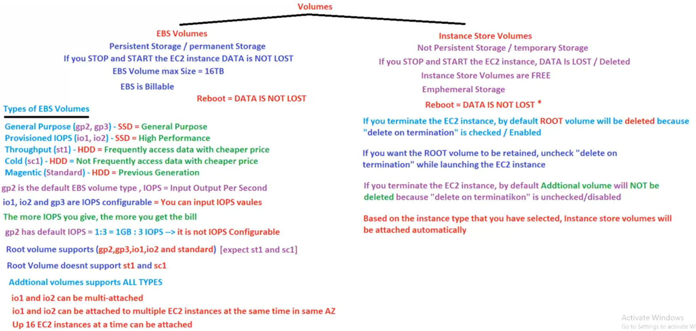

# 20. EC2 with Volumes[ 16/04/2025 ]

---

## Volumes

- There are 2 types of Volumes
    1. EBS
        - It is Persistent/Permanent Storage
        - EBS is Billable
        - Max Storage is 16TB
    2. Instance Store Volumes
        - It is Temporary Storage [ NOT Persistence ]
            - Data will be lost once the Instance is stopped & Started
            - But DATA won’t be LOST if the instance is Rebooted
        - It is aka Ephemeral Storage
        - It is FREE
        - Here, Storage will be automatically allocated based on the instance type

<aside>
💡

Q: If we Terminate the EC2 instance, are we able to recover/access the Root Volume data..?

- Yes,
- By default, root volume will be DELETED as the “delete on termination” is checked [ during instance creation ]
- If we uncheck this opt during Instance creation, we can recover the data even after deletion

Q: If we delete the EC2 instance, by default additional Volumes WON’T get deleted..?

- YES
- By default, “delete on termination” is unchecked
</aside>

## Types of EBS Volumes:

1. General purpose [ gp2, gp3 ] → SSD → Used for general purpose
2. Provisional IOPS [ io1, io2 ] → SSD → Used for High Performance
3. Throughput [ st1 ] → HDD → Used for Frequently Accessed data [ with Cheaper Prices ]
4. Cold [ sc1 ] → HDD → Not Frequently Accessed data [ with Cheaper Prices ]
5. Magnetic [ Standard ] → HDD → Previous Gen HDD

IOPS → Input Output per sec

`gp2` is the Default EBS Volume type 

`gp3`, `io1` & `io2` are IOPS Configurable → We can give IOPS values as input

The more IOPS you configure/use, the more Bill you get

The `gp2` default IOPS is `1:3` → 1GB : 3IOPS

- WKT, `gp2` is NOT IOPS configurable

Root Volume will take `gp2` as it’s default Volume type

- But, we can configure it & it supports gp2, gp3, io1, io2 & Standard volume types
- Root Volume doesn’t support st1 & sc1 volume types
    - i.e., Root Volume supports all volume types except `st1` & `sc1`
- Additional Volumes supports all Volume Types

<aside>
💡

NOTE:

---

WKT, One EBS volume cannot attach to multiple Instances at same time

But, `io1` & `io2` volume types can be attached to multiple instances at same time [ in same AZ’s only ]

- up to 16 EC2 instances can be attached at a time
- All the EC2 instances must be in same AZ’s as of volumes
</aside>

## Backend working of start, stop & reboot

Every time we create an EC2 instance, an EBS volume is attached to it

- This EBS volume is a Centralized Storage

Actually every EC2 is installed/created on a Physical Host Machine

- And if we stop an Instance & start it again,
    - AWS will move this EC2 instance to a new Physical Host machine
    - As the EBS is a Centralized storage, data will still be retained
- And If we reboot the EC2 instance,
    - AWS will keep the instance in the same physical Host machine
    - Hence, Data will also be retained

 

But, if we use an Instance Stored Volume for EC2 instance,

- the volume used for EC2 will be the actual volume of the Physical Host machine [ Hard disk of host machine ]
- So, if we start & stop
    - Then host machine will be changed
    - hard disk will be new
    - Hence data will be deleted/lost
- But, if we reboot
    - Host machine remains same
    - Hence Data won’t be lost

<aside>
💡

NOTE:

---

- Instance stored volumes are very high performant storage devices as it uses the host machine’s local storage
    - But, at risks of data loss if any hardware fails
- where as EBS uses centralized storage which is network based
</aside>

## EC2 status checks

- While creating/launching an EC2 instance, AWS will perform 2 checks
    1. Instance Status Check → Hardware check
    2. System Status Check → Software check
- If only both of these 2 checks are PASSED,
    - Then only, we will be able to use EC2 instance

<aside>
💡

NOTE:

---

- If we get 0/2 check (or) 1/2 checks only are passed,
    - Just stop & start the instance → It will move to other host machine & checks will get pass
    - after this step as well, both checks are not passed → Terminate it & launch a new one again
</aside>

