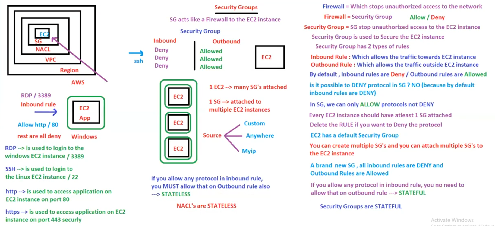

# 23. EC2 Security Groups [ 17/04/2025 ]

---

<aside>
💡

NOTE:

---

WKT, Firewall is used to stop un-authorized access to the Network

- It Allows/Denies the incoming request to access the servers

Similarly, Security Group is Equivalent to Firewall in EC2

</aside>

## Security Group

- `Security Group` → SG stops un-authorized access to EC2 instances
    - SG acts like a Firewall to EC2 instance
    - SG is used to Secure the Ec2 instance
- SG has 2 types of Rules
    1. Inbound Rule → Which allows traffic towards EC2 Instance
    2. Outbound Rule → Which allows traffic away from EC2 instance
- By default, Inbound Rules are DENIED & Outbound Rules are ALLOWED
    - i.e., A newly created SG will have All inbound Rules as DENY & All Outbound Rules as ALLOW
- Every EC2 instance must have at least 1 SG attached
    - And hence, EC2 will have a default SG
- ONE EC2 instance can have Multiple SG’s
- ONE SG can be attached to Multiple EC2 instances

<aside>
💡

NOTE:

---

Is it possible to DENY protocols in SG..?

- NO
- because, everything is Denied by default [ inbound ]
- we can only make them/protocols allow
- If you want to DENY any protocol, just remove that protocol in SG
</aside>

SG’s are STATEFUL

- Stateful → If you allow any protocol in inbound Rule, you DON’T need to allow on outbound rule
- Stateless → If you allow any protocol in inbound Rule, you MUST need to allow on outbound rule

Actual Definitions

- Stateful → If you define any inbound Rule, you DON’T need to define respective outbound Rule
- Stateless → If you define any inbound Rule, you MUST need to define respective outbound Rule

There are 3 types of Source

1. Anywhere
2. Custom
3. MyIP

Generally, we will create a SG for each type of resource [ as shown below ]

But for now, we will use default SG, until we are comfortable with SG’s 

## Subnets

- Subnet → A partition inside the VPC
    - EC2 instances will be launched inside subnet
- ONE Subnet is Associated to ONE AZ
    - ONE Subnet CANNOT be in Multiple AZ’s at the same time
    - ONE AZ can have multiple Subnets

## NACL

- NACL → Network Access Control List
- NACL → Adds another layer of security to EC2 Instance [ on top of SG ]
    - NACL will hit FIRST then SG
- Like SG, NACL will also has Inbound & Outbound Rules
- NACL is for whole SUBNET [ SG is for a Single EC2 instance ]
    - NACL is subnet level
    - SG is EC2 instance level
- By default, All Inbound & Outbound Rules are ALLOWED [ In the Image attached, it is mentioned wrong ]
    - In NACL, we can DENY the Outbound Rules as well
- NACLs are **stateless**,
    - Stateless → need to define both inbound and outbound rules separately, to allow corresponding response traffic
- ONE Subnet is Associated to ONE NACL
    - ONE Subnet CANNOT be in Multiple NACL’s at the same time
    - ONE NACL can have multiple Subnets

