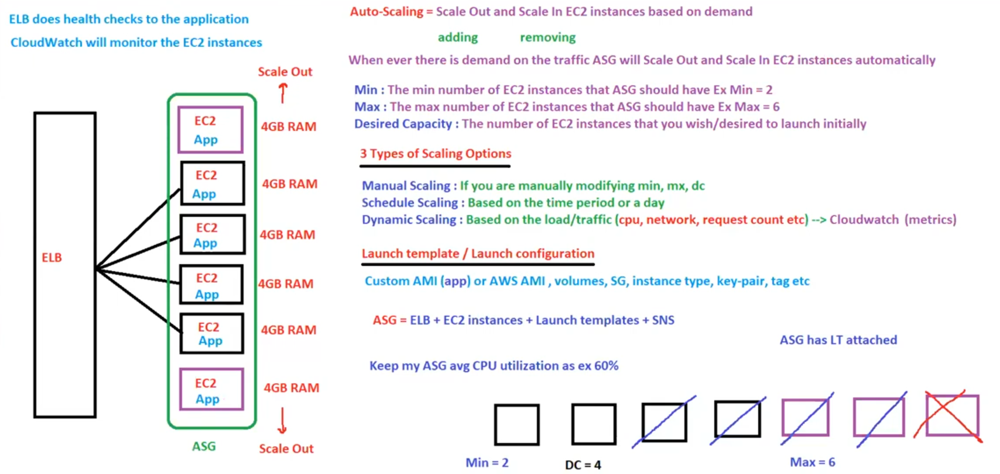

# 24. EC2 Auto Scaling [ 18/04/2025 ]

---

## Auto Scaling

- WKT, `Auto-Scaling` → Scale out & Scale in the EC2 instances automatically based on demand
- These Scaled Instances will also have the Application → Instances created for scaling will be Exact copy of original’s
    - But How does the Scaling know that it contains app & it has t2.micro instance type etc..?
    - We need to configure the Launch Template
        - Launch Template contains images [ custom images or AMI ]
        - Using this Image, ASG will launch instances which will be exact replica of original
- ASG = ELB + EC2 instance + Launch Template + SNS

- `min` → Min number of EC2 instances that the ASG should have
- `max` → Max number of EC2 instances that the ASG should have
- `Desired Capacity` → The number of EC2 instances that are Launched Initially

Scaling Options

- There are 3 Scaling Options
    - Manual Scaling → Manually modifying the min, max & DC
    - Scheduled Scaling → Based on the Scheduled Time Period (or) day, min, max & DC will be changed/modified
    - Dynamic Scaling → Based on the Load/Traffic, scaling will happen

## ELB

- `ELB` → Distributes the incoming Traffic to Multiple EC2 instances across AZ’s
- ELB is a Service → Hence will be completely managed by AWS
- ELB can be accessed using DNS name (or) URL
- ELB will have IP Address too, but it is Dynamic and NOT Static
    - If we use IP address, it gets changed due to it’s dynamic nature
    - And we need to configure the Network/Machine according to new IP Address [ every time it changes ]
    - Hence it is always recommended to use DNS name (or0 URL only

<aside>
💡

NOTE:

---

- ELB monitors the Application
- CloudWatch monitors the EC2
</aside>

Types of LB

- Classic Load Balancer [ CLB ]
    - Previous Gen LB [ Don’t Use ]
    - Works on HTTP, HTTPS & TCP protocols
- Application Load Balancer [ ALB ]
    - It works on Layer 7 → Application Layer in OSI Model
    - It is the Latest Gen
    - It is the default LB
    - Works on HTTP & HTTPS protocols
    - Used in Microservices
- Network Load Balancer [ NLB ]
    - It works on Layer 4 → Transport Layer in OSI Model
    - It is the Latest Gen
    - Works on TCP & UDP protocols
    - Used in scenarios which requires extreme high performance
    - It is the ONLY LB which provides Static IP [ 1 static IP per AZ ]
- Gateway Load Balancer [ GLB ]
    - It works on Layer 3 → Network Layer in OSI Model
    - It is the Latest Gen
    - Works on GENEVE protocols
    - Used to Deploy, Manage & Scale 3rd part network appliances in AWS
        - Used to config firewall, preventions systems etc..

We have Routing Features in ALB

- Host Based Routing
- Path Based Routing
- String parameter Based Routing

These Routing features are NOT present in CLB

- i.e., why we need to have a separate ELB for every domain change
- Hence, CLB is NOT used much

