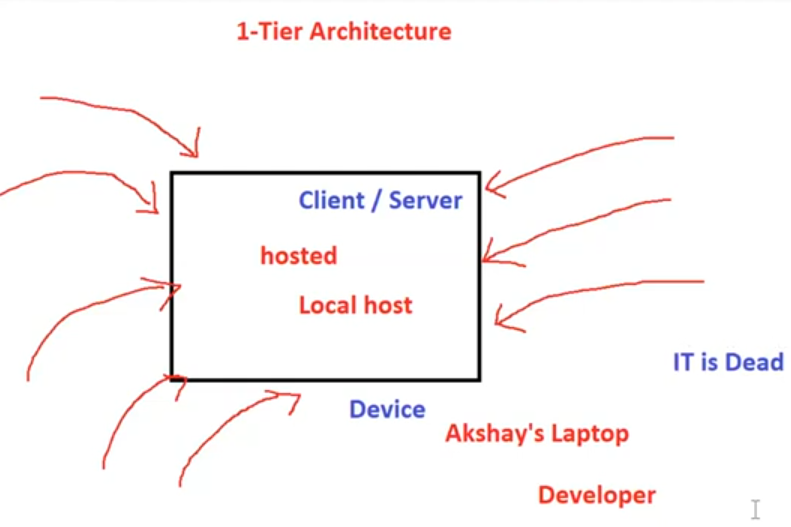

# 02. Client Server Architecture [ 01/04/2025 ]

---

## Client-Server Architecture

- `client` → A Machine which Request the Resource
- `Server` → A Machine which Responds to that Request
- In Order to Communicate, Both Client & Server must be connected to the Network
- A Machine can either be a Client or a Server

`Client-server` architecture is a Network model where clients request services, and servers provide them.

There are several types of client-server architectures, each with its own structure and use cases. 

Here are the main types:

- 1-Tier
- 2-Tier
- 3-Tier
- N-Tier

## 1-Tier Architecture

- The application, business logic, and database reside on a single system.
    - This is essentially a standalone system where the client and server reside on the same machine.
    - There’s no network involved.
    - Hence, App is Hosted/Accessed as Localhost

- Example: A desktop application like Microsoft Excel.
- **Pros:** Simple to develop and deploy.
- **Cons:** Poor scalability and security.

## 2-Tier Architecture

- Divides the system into two layers:
    - **Client**: Handles the user interface
    - **Server**: Handles application logic & database
- In this model, The client communicates directly with the server.

- Example: A basic web application with a database server.
- **Pros:** Faster communication between client and server.
- **Cons:** Limited scalability, as multiple clients directly interact with the database.

## 3-Tier Architecture

- This Model, Introduces a middle layer between client and server:
    - **Client Layer**: Handles the user interface.
    - **Application Layer** (Middle Tier): Processes business logic.
    - **Database Layer**: Stores and manages data.

- Example: Most Modern Web applications with a frontend (React), a backend (Node.js), and a database (MongoDB).
- **Pros:** Improved security, scalability, and maintainability.
- **Cons:** More complex than two-tier architecture.

Protection

- If we make all 3 Layers Public,
    - Then anyone can access the Code from App layer & Data from DB layer
    - So there is security issue
- If we make all 3 Layers private,
    - Then No one can access the web site, Since Client Layer is not accessible to anyone

Hence, we will introduce a New Layer called Web Server

- Here, we will make Client Layer public, So that anyone can access the app
- And we will make both App & DB Layers private → So our Code & Data are NOT Exposed
- Now, we will make Web Server is made Public & will redirects all the request to App servers

This addition of new layers to 3-Tier Architecture is `N-Tier` Architecture

<aside>
💡

NOTE:

---

- `Application Server` → A Server which hosts the Application
- `DB Server` → A Server which hosts the Database
- `Web Server` → It takes the requests [ from Client ] & Re-directs to App Server
    - It is Just a Config File
    - EX: Apache2, nginx
- Devices Communicate with each other using IP Address
    - Hence, App Layer, DB Layer, Client Layer & Web Servers communicate using IP Addresses
- Host Name → Name of the Server
</aside>

---

## Peer-to-Peer Architecture

- Unlike traditional client-server,
    - All devices (nodes) act as both clients and servers.
- Example: File-sharing networks like BitTorrent.
- **Pros:** No central dependency, more fault tolerance.
- **Cons:** Harder to manage and secure.

## Microservice Architecture

- The server is split into smaller, independent services, each handling specific tasks and communicating via APIs.
- Example: Large-scale applications such as e-commerce platforms.

## IP Address

- IP → Internet Protocol
- An `IP address` is a unique identification assigned to a device [ connected to a network ]

It serves two main purposes:

1. **Identification** – It uniquely identifies a device on a network.
2. Communication – It allows devices to communicate with each other over the network