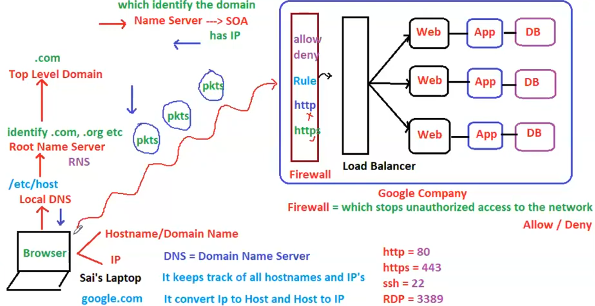

# 03. [ 01/04/2025 ]

---

## How a Request is Made

A Client to Send a Request, It needs IP Address [ of the Server ]

But Client won’t remember the IP Address of Server, due to

- There will be millions of Websites/Servers
- Remembering Numbers is Difficult & IP Address is a Number

Hence, Names will be mapped to IP Address and is called Domain Names 

All of these mapped Domain Names with IP Addresses are Maintained/Stored in a Server called DNS [ Domain Name Server ]

DNS:

- It contains all the Domain Names mapped with IP Address
- It converts IP to Domain Names & Domain Names to IP Address
- This DNS will be provided by ISP [ internet Service Provider ]
- Every Device will have/create a Copy of this DNS [ from ISP ] locally called Local DNS [ Location → `etc/host` ]

So, Browser will send a Request using Domain Name [ instead of IP Address ]

- WKT, each Device will have a copy of DNS called Local DNS
- This Local DNS will retrieve the IP Address mapped to Domain Name
- And Browser will be able to Request the Resource

## What if Local DNS doesn’t have the IP Mapping..?

- Job of Local DNS → is to Provide the IP Address mapped to the requested Domain Name
- But, if the Website is New One → Then Local DNS won’t have the mapping
- Then Local DNS will send a request to RNS [ Root Name Server ] to get the IP mapped to the New Domain
- Job of RNS → is to Identify the extension/TLD [ .com, .org, .in etc.. ] of the Domain Name
    - TLD [ Top Level Domain ] → Extension of the Domain Name
        - Millions of Domain Names will be Segregated based on the TLD
        - Each TLD will have millions of Domain Names
        - Each Domain Name will have a Name Server & SOA [ Start of Authority ]
            - Name Server → Identifies the Incoming Domain name
            - SOA → Contains the Mapped IP Address
    - Based on the TLD, RNS will redirect the request to respective TLD
- Now After Identifying the Extension by RNS, It will be sent to respective TLD [ Top Level Domain ]
- Whatever the Domain Name request sent by RNS to TLD, will be Identified by the Domain Name itself [ using Name Server ]
- And the IP Address [ Stored in SOA ] will be sent back to RNS and to Local DNS & finally to Browser

## Protocols & Port Numbers

- HTTP → 80
- HTTPS → 443
- SSH [ Secure Shell ] → 22
- RDP [ Remote Desktop Protocol ] → 3389

## How Request is received by Server

- First, Request will go through Firewall
    - `Firewall` → Stops Un-Authorized access to the Device’s Network
        - i.e., It Allows (or) Denies the Incoming Request
- Then, Request will hit the Web Server
    - `Web Server` → A Config File which takes incoming request & Re-directs to App Sever
- Finally request will be received by App Server
    - `App Server` will process the Request & Send a Response

In Real Time, 

- There will be Multiple App Servers
- Why..?
    - If one server is down, Request will be Sent to other servers
    - How will be the request sent to other servers when one server gets failed
    - For this, A Server called Load Balancer will be installed to distribute the load
- But Each Server will have a Different IP Address
- So, which IP Address will be assigned to Domain Name..?
    - App Server’s IP Address is NOT assigned with Domain Name
    - Since there will be so many App Servers ⇒ So many Domain Names are required
    - Hence, Load Balancer’s IP Address will be mapped with Domain Name

<aside>
💡

NOTE:

---

- `Firewall` → Stops Un-Authorized access to the Device’s Network
    - i.e., It Allows (or) Denies the Request
- `Load Balancer` → Distributes the Incoming Traffic to Multiple Servers
- Web Server will be replaced by Load Balancer
</aside>