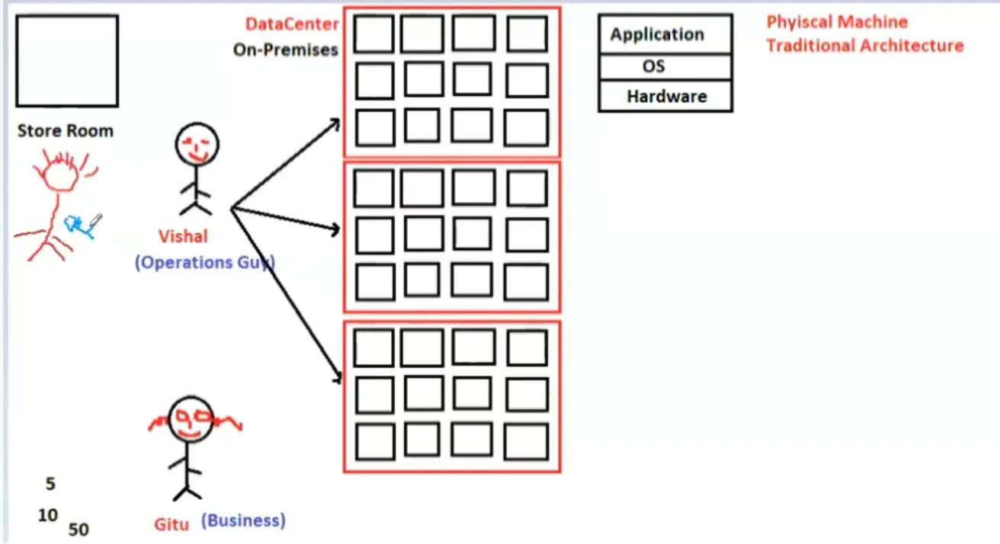

# 04. Data Centers [ 01/04/2025 ]

---

## Data Centers

WKT, our applications will be hosted on a server

- This server requires some hardware upon which OS is installed & then App is hosted

But if the No. of clients (or) people accessing this server increases → load on the server increases. Hence

- We need to increase the server capacity, i.e., CPU, RAM & ROM should be increased
- But these come with limited capacity like CPU at max can have 126 cores, RAM can have 256GB & so on..
- Hence, we will increase the No. of servers to compensate the incoming load
- This place where huge No. of servers installed in a room is called Data Center

`Data Center` → A facility that houses an organization's IT equipment and infrastructure

- IT Infrastructure → Servers, storage devices, networking hardware & Cooling Systems
- A Physical machine comprises of Hardware, OS & Application on top of that
- Handling Data Centers is NOT Easy

- `On-Premises` Data Center → Physical Data Center Located within Organization premises
    - On-premise data centers are commonly used in industries where data privacy and compliance are critical
        - such as finance, healthcare, and government.
    - Requires a significant upfront investment

As Business grows → No. of applications increases → No. of customers/clients visiting the application increases → increases the No. of servers

- Hence, maintaining the servers will become complex & Costly
- Let’s say this as stage-1 → where physical servers are installed & maintained in a place called Data Center→ which increases the complexity

Now, A new technology came into market called Virtualization

- `virtualization` → installing virtual Machines on a physical machine
    - This Virtualization Layer is called `Hypervisor`
    - Virtualization Layer → Application which is used to create VMs
    - `Hypervisor` → An Application/software that enables Virtualization
- Host Machine → The Physical machine on which the virtual machine is installed
- Guest Machines → Virtual Machines created inside the Host machine

Each Virtual Machine will have it’s own hardware [ allocated from Host Machine ], it’s own OS & application

- Each Virtual Machine can have different hardware specifications, different OS installed & different application hosted
- Creating this Virtual Machine is easy [ takes 3-4 minutes ] compared to creating a physical machine with server installed [ takes 3-4 hrs ]
- With this virtualization, Storage Capacity of Data Centers decreased [ takes only 1 room instead of 3 rooms ]
- Hence, maintaining these Virtual Machines are easy compared to stage-1’s Physical Machines → Less Complex & Less Costly
- So, Migration happened across multiple companies from Physical Machines to Virtual Machines which is called P2V migration → Stage 2

But as business grows → No of virtual machines increases → No of physical machines increases → Data Centers Increases 

- Now, we have reached the same starting point where maintaining the Data Centers became Complex
- But Now, it has became even more complex with huge No of Virtual machines inside each of huge No of physical machines
    - i.e., If one Physical Machine is down → All the VMs will go down & it’s applications as well
- Virtualization has increased the complexity of data center maintenance instead of decreasing it

Now, A new technology came into market called Cloud Technology

- Earlier, whenever a new project is allocated, every company used to focus 70% on Infrastructure & 30% on Business
- This Cloud will take care of handling the Data Centers → whole infrastructure will be handled by Cloud ]
- So that the companies can focus more on the Business perspectives instead of focusing more on Infrastructure
- Companies will only pay for the infrastructure used by company → Pay as you go
- Hence, Industries migrated from Virtualization to Cloud → V2C migration → Stage 3

## SUMMARY:

- A Server ****consist of hardware (1st layer), operating system (2nd layer), and hosted application (3rd layer)
- As Business grows → No. of applications increases → No. of customers/clients visiting the application increases → increases the No. of Physical Servers
    - And maintaining the servers became complex & Costly → Stage 1 : Physical Servers
    - Hence, Virtualization emerged
- `virtualization` → installing virtual Machines on a physical machine
    - Each Virtual Machine will have it’s own hardware [ allocated from Host Machine ], it’s own OS & application → Less Costly
    - Creating this Virtual Machine is also easy [ takes 3-4 minutes ] & as multiple VM in a Single Physical Machine → maintaining is easy & Less complex
    - So, Migration happened from Physical Machines to Virtual Machines which is called P2V migration → Stage 2
    - But as business grows → No of virtual machines increases → No of physical machines increases → Data Centers Increases
        - But Now, it has became even more complex with huge No of Virtual machines inside each of huge No of physical machines
    - Virtualization has increased the complexity of data center maintenance instead of decreasing it
- Hence, Cloud Technology emerged to take care of handling the Data Centers & it’s infrastructure
    - Now, companies can focus more on the Business perspectives instead of focusing more on Infrastructure
    - Hence, Industries migrated from Virtualization to Cloud → V2C migration → Stage 3

<aside>
💡

**Stage 1: Physical servers in data centers, becoming complex and costly to maintain⁠⁠**

**Stage 2: Virtualization (P2V migration), initially easier to manage but eventually increasing complexity⁠⁠**

**Stage 3: Migration to cloud (V2C), offering pay-as-you-go model and allowing companies to focus on business rather than infrastructure⁠⁠⁠**

</aside>