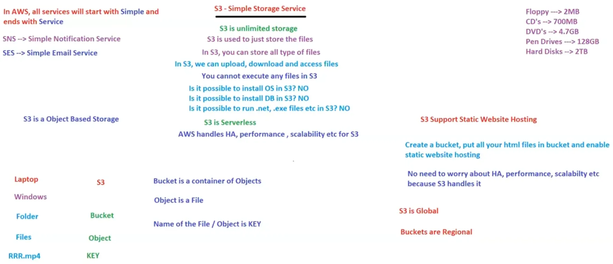

# 10. S3 & EBS [04/04/2025 ]

---

<aside>
💡 In AWS, Generally all the services starts with Simple & ends with Service

</aside>

## S3

- `S3` → Simple Storage Service → A Service provided by AWS, which offers unlimited storage
    - It can store any kind/type of files
    - It is used to upload, download & access any type of files
    - We cannot execute any files [ like .exe, .NET etc.. ]
    - We cannot install any app, OS or DB
    - S3 is server-less [ No need to Login to Machine/Server ]
    - As it is a service provided by AWS → HA, Elasticity, Scalability & performance etc.. are managed/handled by AWS
- Folder (or) Directory in S3 is called `Bucket` → is a container of Objects
- File in S3 is called `Object` → file
- Name of files/Objects is called `Key` → name of file
- Hence, S3 is an Object based storage [ Since, we upload Objects into S3 ]
- S3 supports [ main feature ] Static Website Hosting [ since DB is NOT required as content is static ]
- S3 is `Global` but Bucket is `Regional`

Whenever we launch an EC2 instance

- AWS will provide default storage depending on OS [ where OS will be kept ]
    - Windows → 30GB
    - Linux → 8GB
- This default storage is root storage
- What if we require additional storage space..?
- There comes the another service called EBS

<aside>
💡

NOTE:

---

Storage space (or) Hard Disk in AWS is called `Volumes` [ EBS Volumes ]

→ Default volume in an EC2 instance is called “Root Volume”

→ Other Volumes are called “Additional Volumes”

→ Root Volume always contains OS

⇒ Volume in which OS is installed is called `Root Volume` 

→ EC2 only supports Server based OS

There are 2 types of OS

- Client based OS → Windows 10, 11
- Server based OS → Windows server 2021, RedHat, CentOS, Ubuntu, OpenSUSE

How many Root Volumes can an EC2 Instance have..?

- Only 1 [ Since only 1 OS can be installed in a single EC2 instance ]
    - EC2 instance can only have 1 Root Volume
    - EC2 instance can have multiple additional volumes [ Additional Volume → Volumes without OS installed ]
</aside>

## Elastic Block Storage [ EBS ]

- EBS → Elastic Block Storage
    - Hence, Do NOT use/call Elastic Bean Stalk as EBS
    - Because, EBS stands for Elastic Block Storage
- `EBS` is a Centralized storage system, used to attach & detach volumes to EC2 instances
    - i.e., whenever an EC2 instance requires additional volume, It will take from EBS & attach
    - We can attach/detach multiple volumes to an EC2 instance
- Volumes in EBS is called EBS volumes
- Both Root Volume & EBS volumes attached to EC2 instance can be increased on the FLY → No need of downtime to increase volume capacity
- But Volume size CANNOT be decreased on the FLY, we need to detach it, delete it & attach a new volume [ i.e., why we need to be careful with volumes ]
- EBS is called Block Based Storage

<aside>
💡

NOTE:

---

What is the maximum size of an EBS Volume..?

→ Maximum size of an EBS Volume is 16TB

→ Volumes can be pre-provisioned like 50GB, 100Gb … 16TB

Can we attach a single EBS volume to multiple EC2 instances at the same time..?

→ NO

→ But AWS made this possible with some volumes as a latest feature

</aside>

EC2 instance always boots from Root Volume [ Since OS is installed in Root Volume ]

But How does the EC2 instance know the root volume..?

- Here comes the Device Names
- Each Volume in EC2 instance is given names
- Root Volume always have device name→ `/dev/sda1`
    - Hence Root Volume is always mounted as `/dev/sda1`
    - But for some Ubuntu instances → `/dev/xvda`
- For Additional volumes, we can give any name except “a1” → `/dev/sdb,sdc,sde1..`

<aside>
💡

NOTE:

---

Is it possible to detach/unmount the Root Volume while EC2 instance is running..?

→ NO
→ Stop the instance & then unmount/delete

Is it possible to detach/unmount the Additional Volume while EC2 instance is running..?

→ YES, 
→ But It is NOT recommended [ as some people may work on that data → intimate first & then delete ]

Is it possible to Delete the Volume, while EC2 instance is Running..?

→ NO,

→ We need to first detach it, then delete it

WKT, EC2 has AZ ⇒ Volumes also has AZ [ Volumes → Both Root & Additional ]

So, 1a Volumes can be attached to 1b EC2 instance..?

→ NO

→ So, EC2 & Volumes [ Both root & Additional ] must be in same AZ [ attach/detach of volumes across AZ’s CANNOT be done ]
→ i.e., we cannot attach 1a volume to 1b EC2 instance 

→ WHY..?

→ Since they are from different AZ’s 

</aside>

WKT, we cannot attach a single volume to multiple EC2 instances

But What if I require as shared volume → where 1 volume is shared among multiple EC2 instances

We will discuss this in Next Class