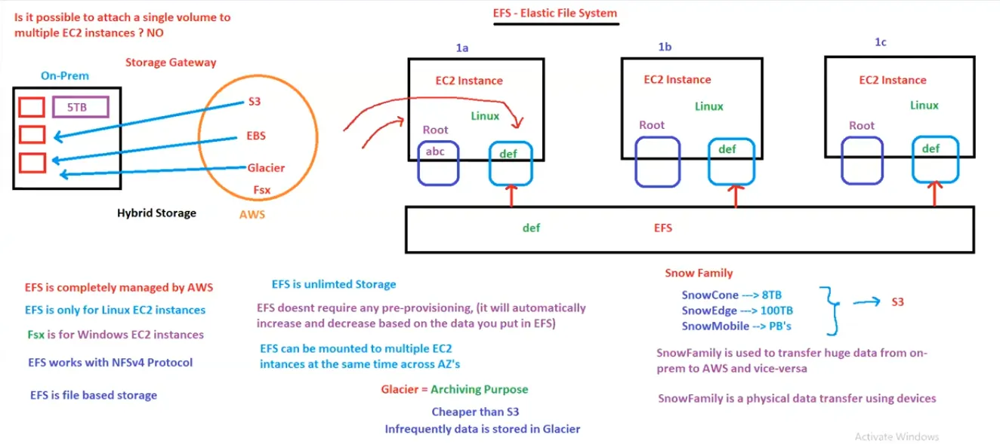

# 11. EFS, RDS [ 05/04/2025 ]

---

## Elastic File System [ EFS ]

WKT, one additional volume cannot be attached to multiple EC2 instances

Hence, EFS came into picture to have a shared data among multiple instances

- `EFS` is a service provided by AWS, which is used to have shared data among multiple EC2 instances [ similar to file server which is NFS based ]
    - As it is a service by AWS, EFS is completed managed by AWS only
    - EFS follows NFSv4 protocols [ NFS - Network File System ]
    - EFS only works with Linux based EC2 instances
        - FSx is for Windows based EC2 instances [ No abbreviation for FSx ]
    - EFS is a File Based Storage
    - EFS is unlimited Storage [ Similar to S3 ]
    - We can mount EFS to multiple [ like 1000’s ] EC2 instances
- WKT, EBS is pre-provisioned → we will reserve the volume beforehand & pay for how much volume we have booked
    - But EFS is NOT pre-provisioned,
    - It will automatically increase/decrease based on the data usage & will cost only to the used storage
- EFS can be mounted to multiple EC2 instances across AZ’s [ where as EBS cannot ]

## Snow Family

- `Snow Family` → Used to move/transfer huge data from on-premises to AWS Cloud & vice-versa
- Snow Family is a physical data transfer using physical devices
- Snow Family has 3 types of physical devices based on Size of data
    - SnowCone → Upto 8TB [ size of a hard disk ]
    - SnowEdge → upto 100TB [ size of a CPU/briefcase ]
    - SnowMobile → PB’s [ size of a container ]
- All of these huge data is stored in S3

What if the data is NOT in use since some time [ like may be years or months ]

Where do we keep this data..?

- Is it in S3 or EBS or EFS..?
- NO, For this type of non-frequently used data, AWS is providing another service called Glacier

## Glacier

- Glacier = Archiving = Zipping
- `Glacier` → It is an AWS service where All the in-frequently accessed/used data is stored
- It is used for archiving purpose
- It is cheaper than S3

## Storage Gateway

- WKT If we use on-premises data storage, there will always be storage constrains
    - i.e., on-premises data storage is always limited, [ if we require more storage, we will add more storage ]
    - But AWS S3 is Unlimited Storage
- What if we want Unlimited Storage on-premises..?
- AWS provides a service called `Storage Gateway` → used to mount/provide S3, EBS, Glacier & FSX on-premises
    - Only these 4 services can be mounted on-premises
- `Storage Gateway` allows us to use AWS Storage services on-premises
- AWS services are Public & on-premises are private →Hence, Storage Gateway is Hybrid network

<aside>
💡 `On-premises` →refers to *IT infrastructure hardware and software applications that are hosted on-site, within the organization's premises*

</aside>

## Relational Database Service [ RDS ]

- `RDS` → A Service provided by AWS, which is used to setup, configure, manage & maintain RDBMS’s in AWS
- RDS is NOT a Database, It is a Database Service
- similar to Application VM’s are called EC2 instances, these Database VM’s are called RDS instances
- RDS supports only RDBMS databases only
- RDS supports 6 Engines → MOMMAP
    - MySQL → opensource
    - Oracle → Oracle
    - MSSQL → Microsoft
    - PostgreSQL → opensource
    - MariaDB → Community Based
    - Aurora → AWS [ This AWS proprietary ]
- As this is a service, we cannot login to these DB’s.
    - We can ONLY setup it, but NOT created any data/users

<aside>
💡 `DynamoDB` → NoSQL database service in AWS [ Non-Relational ]
`DMS` → It is a service used to migrate DB from on-premises to AWS [ Database Migration Service ]
`RedShift` → Data-warehouse service in AWS

Database → Used to store the data [ ex: RDS, DynamoDB ]
Data-warehouse → Used to store huge data [ ex: RedShift ]

</aside>

## ElastiCache

- Whenever we hit a website, it will request the back-end to get the data from DB
- But if we hit the same website again, it will store the data in a cache memory & will use it to speed up the loading time
    - “Cache memory” → a high-speed buffer, used to store frequently accessed data for quick retrieval,
    - This cache is also stored in a DB called Cache Database

`ElastiCache` → In Memory Database Caching Service by AWS

- It supports 2 Caching Engines
    - Redis
    - Memcached

<aside>
💡 `buffer` →a reserved segment of memory (RAM) within a program used to hold data temporarily while it is being processed. 
Buffers enable data to be stored and retrieved efficiently, allowing programs to operate effectively.

**Software Cache →**refers to temporary storage of data or instructions in a computer system’s memory to enhance performance.

This can be implemented in applications or devices, reducing data retrieval time and effort.

</aside>

## What is the difference between Snow Family & Storage Gateway..?

- `Snow Family` is a service used to physically data transfer/migrate from on-premises to AWS & vice-versa
- `Storage Gateway` → is a service used to mount the AWS services to on-premises & data storage/transfer is still online