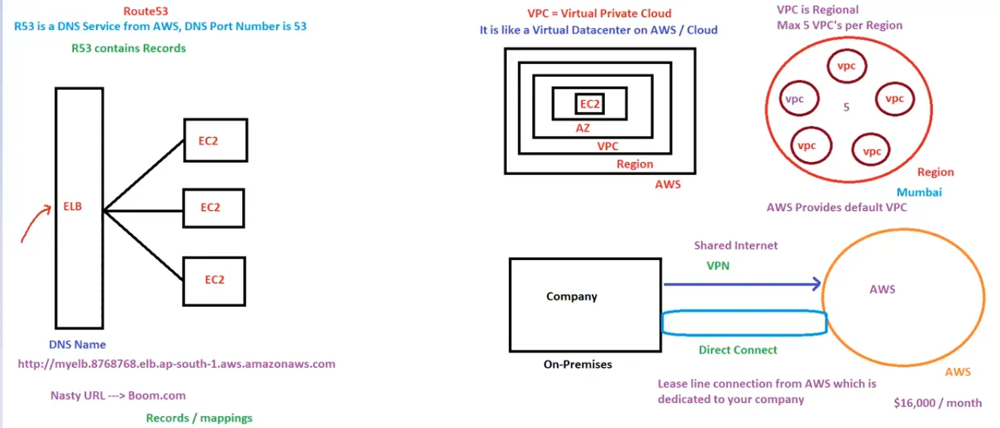

# 12. Route53, VPC [ 05/04/2025 ]

---

<aside>
💡

NOTE:

---

- WKT, ELB is used to distribute the incoming Traffic to multiple EC2 instances across AZ’s
- And we/client access the ELB using URL of Domain Name
- But this URL with Domain Name is NOT the actual USABLE Domain Name
- It needs to changed to Actual USABLE Domain Name
- The Service which does this is Rout53
</aside>

## Route53

- `Route53` is a DNS service from AWS
    - DNS port number is 53, Hence Route53
- R53 contains these Records
    - In AWS, The mapped ELB’s URL’s & the Actual Domain Names are called Records
- R53 is Global

## Virtual Private Cloud [ VPC ]

- VPC is Regional
- only 5 VPC’s per Region
- VPC is like a Virtual Data Center [ Since all the instances, DB, ELB, AZ contains within it ]
    - Since Data center is called AZ → VPC is a virtual AZ
- Any 2 VPC’s cannot communicate with each other [ but we can make it ]
- AWS provides default VPC [ Since it is difficult to setup for beginners/first time users ]
    - Since, VPC is at Regional Level → Every Region will have default VPC

## Direct Connect

Our company will connect to AWS using Internet

- But Internet is shared network → Any one can publicly access the data
    - So, i.e., why VPN [ Virtual Private Network ] is used by Companies to get secure, encrypted connection from companies to AWS
    - And VPN is also a shared Network, but much more strongly encrypted
- Hence AWS offers a service called `Direct Connect` → which provides private lease line connection only to dedicated company
    - It is very Costly [ 16,000/- USD ]
    - It is much more protected than VPN’s

## CloudFront

We will host the application in our nearby Region’s AZ’s

This will makes sure low latency for the people who are nearby the Region, But high latency to far away Regions

How to provide the Low latency in all regions..?

- We need to deploy the Application in all Regions, But it is very costly
- Hence, AWS provides CloudFront

CloudFront Service will contain Edge Locations

- Edge Locations will Cache the Applications
- So Every Time, A nearby Edge Location will respond to the request & hence reduces the Latency
- EL’s are configured using CloudFront
- EL’s are completely managed by AWS [ under CloudFront Service ]

Every Region will have Edge Locations

- `Edge Location` contains the cached application
- EL’s are completely managed by AWS

CloudFront is used to create Distributions [ like an instance in EC2 & RDS ]

- Distributions contains configuration like
    - Origin
    - In which continents does the cache is required [ to cache the application in all those respective Region’s EL ]
- It uses CDN to distribute the application for caching
    - i.e., EL uses CDN for Caching
    - EL’s are Connected with CDN
- We need to configure EL using CloudFront
- We need to give TTL
- `TTL` → Time To Live → ***maximum amount of time that the cached record/data can exist on a EL***
    - After the TTL spent, Application will be cached again with new data
    - Application will be cached based on TTL
- Invalidate Cache → Used to forcibly cache the data immediately irrespective of TTL

Cloud Front caches both static & Dynamic Application

CloudFront used to reduce the latency across the Globe

- Since, the response to the request is sent by Edge Location, but NOT by the Origin Location

We can restrict some of the locations using *Geo-Restrictions*

<aside>
💡 Which service will be hit first, if any request is made..?
→ Route53 [ Since R53 has the Mapping ], then it will redirect to the ELB 
→ Actually [ If CF is Used ] Route53 redirects to EL which contains the origin URL [ ELB ] configured by CloudFront [ Since EL contains the copy of ELB ]

</aside>

