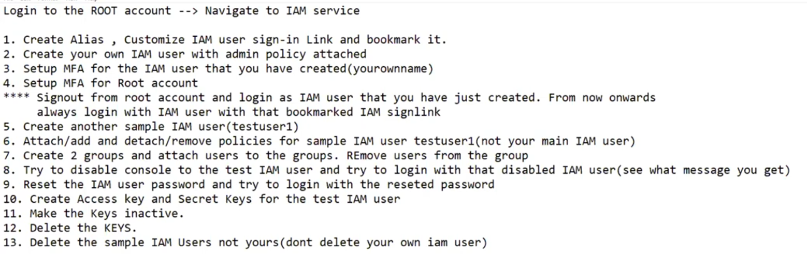

# 17. IAM Practical's [ 08/04/2025 ]

---

IAM User sign-in URL/link will be same for all IAM Users

- It is used to sign-in different IAM users using a single Root Account Alias
- How..?
    - If we hit this link/URL. this will open a login page,
    - where IAM user needs to login using his Username & Password

We can disable the IAM user console access from 

- [ IAM service >> Users ] >> security Credentials tab >> Manage Console Access
    - From here, we can Enable/Disable the IAM User
        - Once disabled, old password will be removed → NO Password
    - From here, We can generate new Password too

How to Disable the IAM user Programmatical Access..?

- We can disable the Programmatical access by deactivating the keys
- Even when we select the delete button , It will 1st ask for deactivate & Then delete

## Practical’s

## Solutions

1. URL/Link ->[https://kumarjallipalli.signin.aws.amazon.com/console](https://kumarjallipalli.signin.aws.amazon.com/console)
2. Created an User → `SJAdmin`
3. DONE
4. DONE
5. DONE
6. DONE
7. DONE
8. DONE —> Getting message like this when accessing **`Authentication failed:** Your authentication information is incorrect. Please try again`
9. DONE
10. DONE
11. DONE
12. DONE
13. DONE

<aside>
💡

NOTE:

---

- We can create/modify an User with NO Policies attached
- We can RESET the password of an User, without existing password
    - RESET Password option is available in Security Credentials >> Manage Console Access
</aside>