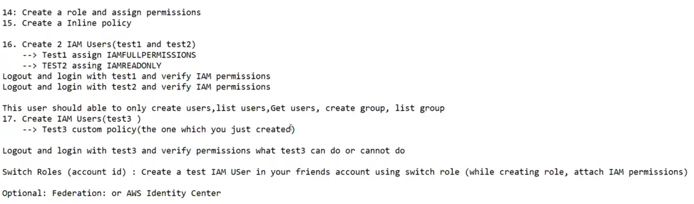

# 18. IAM Practical’s II [ 09/04/2025 ]

---

<aside>
💡

NOTE:

---

- IAM is FREE Services in AWS
</aside>

## IAM Role Practical’s

- For now, we will only learn
    - How to create role
    - How to attach created role
- We will learn
    - How to use the Role in later part

Scenario’s

- We need to give Access to S3 service to an Application receding in EC2 service
    1. Create Role
    2. Trusted Entity → AWS Service
    3.  Use Case → EC2 [ To whom this role will be attached ]
    4. Add permissions → S3 [ To which service, this role needs access → Role permissions ]
    5. Create Role

- Switch Role
    - Create Role
    1. Trusted Entity → AWS Account [ This is the difference ]
    2.  Use Case → EC2 [ To whom this role will be attached ]
    3. Add permissions → S3 [ To which service, this role needs access → Role permissions ]
    4. Create Role

<aside>
💡

NOTE:

- Default Session time for Role → 1hr
- Max Session time for Role → 12hr
</aside>

## Organization

<aside>
💡

NOTE:

---

- In AWS Organization, who pays the bill..?
    - In an AWS Organization, the **management account** is responsible for paying the bills for all member accounts within the organization
- will there be an option for member accounts to pay bills for their own accounts
    - No, AWS Organizations doesn't allow member accounts to pay their own bills directly.
    - All billing is handled centrally through the management account, which consolidates the charges for all member accounts in the organization.
</aside>

## Practical’s

