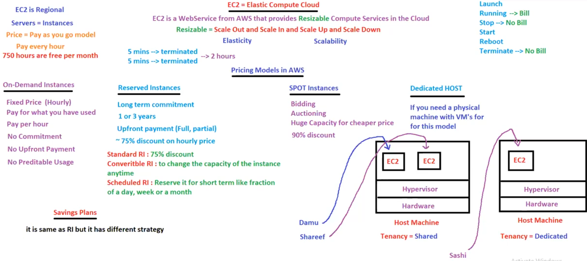

# 19. Intro to EC2

---

<aside>
💡

EC2 → Elastic Compute Cloud

</aside>

## EC2

- `EC2` → A Webservice from AWS which provides Re-Sizable Compute Services over the Cloud
    - Re-Sizable → Scale out & Scale in [ Elasticity ], Scale up & Scale down [ Scalability ]
- EC2 is Regional
- Servers in EC2 are called Instances [ Servers == Instances ]
- Price = Pay as you GO model [ Charges on hourly basis, even if you use for 1min ]
    - For 1st year, 750hrs of free t2.micro is free per account

## Pricing Models in AWS

1. On Demand Instances
    - No Commitment
    - No Upfront Payment
    - Fixed Price [ Hourly ]
    - Pay for what you have used
    - No predictable usage
2. Reserved Instances
    - Long Term Commitment [ 1 or 3 years, there is NO 2 years ]
    - Upfront Payment [ Full, Partial ]
    - Hence, Discounted Prices [ 75% discount on hourly prices ]
    - It has 3 types
        - ***Standard RI*** → Standard RI which gets 75% discount
        - ***Convertible RI*** → Able to Change the Capacity of Instances anytime [ Vertical Scalable ]
        - ***Scheduled RI*** → Reserve it for short term like fraction of a day, week or month
3. SPOT Instances
    - Instances are bought using Bidding/Auctioning,
        - where huge capacities are bought for cheaper prices [ like 90% discount ]
    - This is only Temporary purpose [ as someone bids for more, Instances will be discontinued ]
4. Dedicated HOST 
    - In this Model, we will the get the actual Physical Host machine [ with VM’s ]
    - The Physical HOST machine is NOT shared with others
5. Savings Plan
    - This is same as RI but with different Strategy

## EC2 Families/Instance Types

- Instance Type = `CPU + Memory`
    - t2.micro is free tier instance
- Scalability is AWS is achieved by changing the instance type
    - We can do Scale Up & Scale Down anytime we want
    - Scalability persists data → No Data Loss during scalability [ As data is stored in Volumes ]
- We CANNOT change the EC2 Instance type while running →
    - We need to Stop the Instance & Change the Instance type
    - Hence, Downtime will be faced/required  [ For HA, there is NO Downtime ]

## Burstable Performance Instances

- This is a Billable Service from AWS
- If we enable/opt this service, AWS will provide some CPU credits
    - we can use these CPU’s credits for VCPU’s instantly whenever required
    - Hence, performance will gets increased
- i.e., EC2 instance will enter into burstable mode, where it gives high performance for limited period of time only
    - This service can be used when we cannot use Elasticity or Scalability in AWS & for limited time
    - CPU credits will vary depending on the Instance type selected
- Only t2 & t3 supports Burstable Instances

