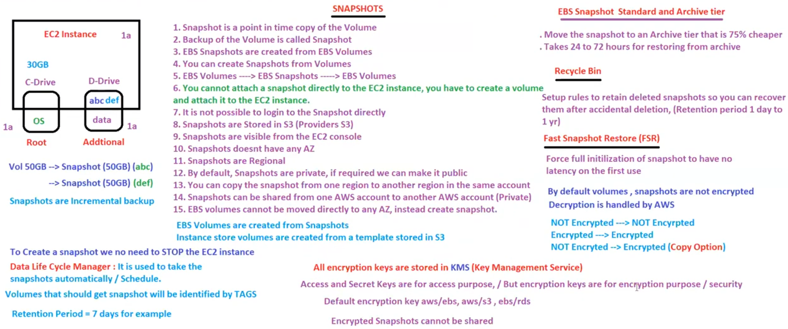

# 21. EC2 Snapshots [ 16/04/2025 ]

---

## Snapshot

- `snapshot` → Incremental Backup of Volume
    - Only initial snapshot will be full volume backup
    - for the rest of the snapshots, Only the modified data will be backed up → Hence incremental Backup
- Snapshot is a Point in time backup/copy of Volume

- we can create snapshots from volumes & volumes from snapshot
- EBS snapshots are created from EBS volumes
    - EBS volumes —> EBS snapshots —> EBS volumes
- You cannot attach snapshots directly to EC2 instance
    - First create volumes from snapshot & then attach to EC2 instances
- Snapshots are stored in S3 [ AWS S3 ]

- Snapshots are visible from EC2 console
- Snapshots are regional [ volumes are also regional ]
- By default, snapshots are private
    - if required, we can make it public
- We can copy snapshot from one AZ to another AZ [ in the same account ]
- Snapshots can also be shared/copied from one Account to another Account
- EBS volumes CANNOT be moved/copied directly to any AZ, it can only be done using snapshots
- To Create Snapshots, we do NOT need to stop EC2 instance
- It is NOT possible to login to snapshots

<aside>
💡

NOTE:

---

- EBS volumes are created from snapshots
- Instance Store Volumes are created from a Template stored in S3 [ by AWS ]

Retention Period → How many days can the snapshots will be stored

</aside>

### What if we required to take snapshots of N number of Volumes..?

- we use Data Life Cycle Manager
- It is used to take snapshots automatically at scheduled times
- which volumes are to be taken for snapshots will be identified using tags

### Tiers

EBS Snapshot Standard Tier → Snapshots that are currently used will be stored here

EBS Snapshot Archive Tier → Snapshots that are not currently used will be stored here

- Archive Tier is 75% cheaper than Standard Tier

### Recycle Bin

All the deleted snapshots will be available in `Recycle Bin`

- Recycle Bin will also have retention period
- We can configure this retention period from 1 day to 1 year
- We can Recover the Snapshots from accidental deletions using Recycle Bin

### Fast Snapshot restore [ FSR ]

- Generally, It takes 24 to 72 hours to restore volume from Snapshot [ depending on size ]
- But to create a Volume faster/quickly, we can use this FSR
- `FSR` → Forceful initialization of Snapshots to have no latency on First Use
- It is Billable

### Security

- By default, Volumes & Snapshots are NOT Encrypted
- we can Encrypt using COPY option
- All the Encryption keys will be stored in KMS [ Key Management Service ]
    - These are NOT same as Access & Secret Keys
- Decryption will be handled by AWS
- Encrypted Snapshots CANNOT be shared with other Accounts
    - As to decrypt the snapshots, we need to share the Encryption keys as well

## Images

- `image` → Copy/Template of OS
- In AWS, it is called AMI → Amazon Machine Image
- `AMI` → Copy of Entire EC2 instance [ including Volumes ]
    - AMI contains OS (or) OS + Apps + Configs
- Using AMI, we can create EC2 Instance & Using EC2 instance, we can create AMI’s
    - Ec2 Instance —> Image [ AMI ] —> EC2 Instance
    - AMI will be Exact copy of the EC2 instance
    - one AMI is used to launch Multiple EC2 instances
- AMI’s are also stored in S3
- AMI’s are Regional
- AMI’s are copied from One Region to Another
- AMI’s can be shared from One Account to Another Account using AWS ID
- All public Images are available in Market Place
- TYPES:
    - Custom Images → Manually Created Images
    - Golden Images → Images Created using Automation [ using EC2 Image builder ]
- Images are Backed by either EBS Volumes or by Instance Stored Volumes

If an EC2 contains N no. of Volumes, then if we create an Image out of it

It will create N no. of Snapshots as well along with ONE Image

## How to move Volume from one EC2/AZ to Another EC2/AZ

- We will take snapshots of the Volume which is diff AZ
- Create volume in the target AZ
- Attach it to the Target EC2
- SO the same steps to other Volume as well

