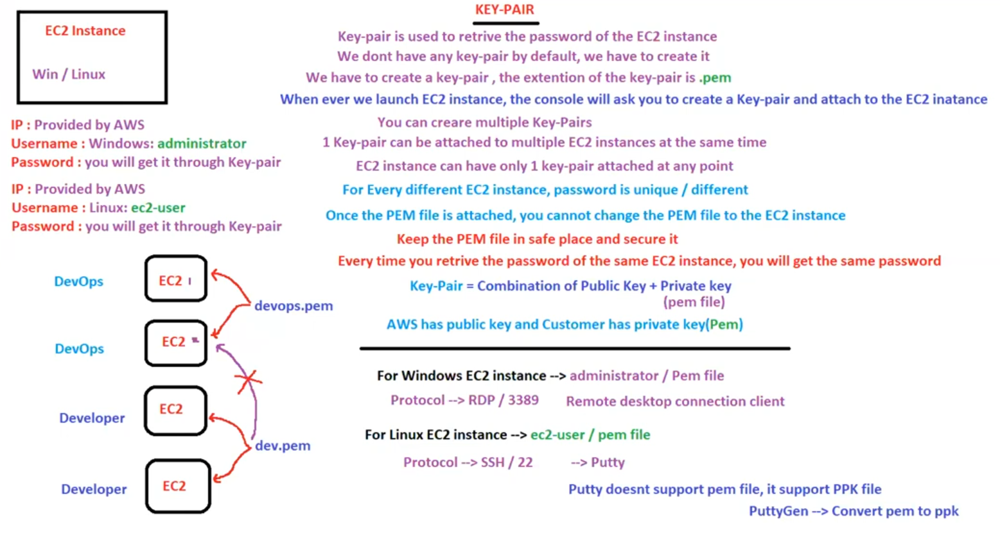

# 22. EC2 Key-Pair [ 16/04/2025 ]

---

<aside>
💡

NOTE:

---

To connect to any EC2 Instance, we require

- IP Address → Provided by AWS
- Username → by Default available
- Password → We will get it through Key-Pair
</aside>

## Key-Pair

- `Key-Pair` → Used to Retrieve Password of the EC2 instance
    - Default EC2 instances Username’s are
        - Windows → administrator
        - Linux → ec2-user
    - There is NO default Key-Pair → We need to Create it
        - Whenever we create an EC2 instance, it will ask us to create Key-Pair
- Extension of Key-Pair is `.pem`
- ONE EC2 Instance can have only ONE Key-Pair
    - ONE Key-Pair can be attached to Multiple EC2 instances, But NOT recommended
- Once the `pem` file is attached, you cannot change it again

<aside>
💡

NOTE:

---

- For Every Different EC2 instance, Password is UNIQUE
- But For all the EC2 instances who have same `pem` file attached, will have SAME Password
</aside>

Why it is called Key-Pair..?

It will have 2 Keys

- AWS will have a public key
- User will have the Private Key
- Together called Key-Pair → Combination of Public Key & Private Key
- If both keys matches, then only accepted

## Why a Single `.pem` file is NOT recommended to use for Multiple Instances

- If you use ONE `.pem` file for all EC2 instances, Then
    - any user having that `.pem` file can connect with EC2 instance
- Let’s say, we have 3 EC2 instances created for 3 groups like DevOps, Devs & Testers
    - If we use single `.pem` file, then Testers can connect to Instances maintained for Devs & DevOps & Vice Versa

## What if there are 100 users who needs access to connect to EC2 instances

- We will use Active Directory
    - Here, Users are called Domain Users → Who logins using Domain name & password
    - And the Users with `.pem` file are called Admin/Local users → Who has the `.pem` file locally
- Here, we will manage each User using Domain names → Hence called Domain Controller
    - All these Domain Users can login  to any EC2 instance using their respective credentials

<aside>
💡

NOTE:

---

- When we launch Multiple EC2 instances, Will all of those instances created on a Single Host System..?
    - NO,
    - EC2 Instances will be randomly shared/created across Multiple Host Systems
    - If you want all of them to be on a Single Host System → Go with Dedicated Host Pay Model
</aside>

## Cluster Networking Instances

- `Cluster` → Group of Servers/Instances
- As New EC2 instances are spread out across Multiple Host Systems,
    - There will be Latency & Low Performance
- Hence, these EC2 instances are grouped together into cluster to get High Performance
    - This Group is called Placement Group
    - Placement Group is Group of EC2 instances used to increase the Performance between EC2 instances
- There are 3 Types
    - Cluster Placement Group → Grouping Instances in same AZ’s → High Performance & Low HA
    - Spread Placement Group → Grouping Instances across AZ’s → High HA
        - Here, In 1 AZ, only 7 EC2 instances can be Launched/Created
    - partition Placement Group → Grouping Instances across AZ’s → High HA
        - Max 7 Partitions
        - Each Partition can have 100’s of Instances

Placement Group recommends to have same homogeneous Instance Types

