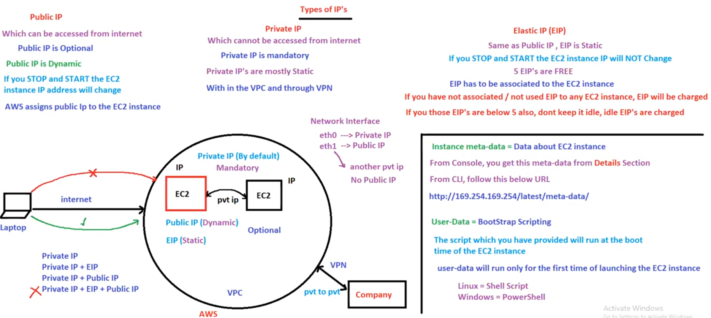

# 25. EC2 IP’s & GA [ 18/04/2025 ]

---

## Types of IP

- There are 3 types of IP Addresses
    1. Public IP
    2. Private IP
    3. Elastic IP

When ever we create an EC2 instance, By default AWS will assign Private IP

- This Private IP is Mandatory [ to generate ] as well
    - As within AWS/VPC, EC2 instances & Other Services will communicate using Private IP
- This Private IP won’t change [ even after stop & stop ]
- Private IP cannot be accessed over internet

But for other devices to connect to this EC2 over Internet, we need Public IP

- This Public IP is Optional
- This Public IP is Dynamic [ i.e., it changes after stop & start ]

Hence we will use Elastic IP

- EIP is same as Public IP, but EIP is Static
- So, EIP won’t get change after stop & start of Instance
- 5 EIP’s are FREE
    - But if you take EIP & is NOT used/assigned to any EC2/Service,
    - AWS will charge for it, even if it is below 5
    - i.e., AWS will change for idle EIP

To get the Instance Meta data [ i.e., data about the instances ]

- From console, got to Details Section
- From CLI, go to this URL → `http://169.254.169.254/latest/meta-data/`

### User-data

- User-data == Bootstrap Scripting
    - `bootStrap Script` → Script which will gets executed/run at the Boot Time of EC2 instance
    - But This User-data (or) Bootstrap Script will run only at the 1st launch/creation of EC2 instance
        - In Linux, it is written in Shell Script
            - To make the script run on every reboot, you can modify the `cloud-init` configuration.
                
                ```yaml
                cloud_final_modules:
                  - [scripts-user, always]
                ```
                
        - In Windows, it is written in PowerShell
            - To run user data scripts every time you reboot or start the instance, add **`<persist>true</persist>` in Power Shell**
    - User data can be accessed at **http://169.254.**169.254/latest/user-data/ from the EC2 instance

## Network Interfaces

- Every EC2 instance will have 2 `eth`
    1. `eth0` → Private IP [ Mandatory ]
    2. `eth1` → Public IP
- If we use 2 private IP’s for a Single Instance,
    - Then we cannot attach a Public IP [ as the ethernet ports are full ]



## EC2 Launch Steps


<aside>
💡

NOTE:

---

- Unicast IP → Only ONE Server holds ONE IP
- Anycast IP → ALL Servers holds same IP & request is routed to nearest one
</aside>

## Global Accelerator

- AWS Global Accelerator is a networking service designed to improve the performance and availability of your applications for users worldwide.
- It provides static IP addresses that act as fixed entry points for your application,
    - routing traffic through the AWS global network to the optimal regional endpoint based on factors like health, client location, and policies.
- It provides 2 static IP’s
- It uses Edge locations in the Backend
    - Hence boosts performance & Low latency
- It is Billable


---

## How to To modify the cloud-init configuration to make user data persistent in EC2

To modify the cloud-init configuration and make user data persistent in an EC2 instance, follow these steps:

1. **Access the Instance**:
    - Connect to your EC2 instance using SSH.
2. **Edit the Cloud-Init Configuration**:
    - Open the cloud-init configuration file located at `/etc/cloud/cloud.cfg` using a text editor like `nano` or `vim`.
3. **Modify the `cloud_final_modules` Section**:
    - Locate the `cloud_final_modules` section in the file.
    - Add or modify the `scripts-user` directive to include `always`. It should look like this:
        
        ```yaml
        cloud_final_modules:
          - [scripts-user, always]
        ```
        
4. **Save and Exit**:
    - Save the changes and exit the editor.
5. **Test the Configuration**:
    - Reboot the instance and verify that the user data script runs again.
    - You can check the logs in `/var/log/cloud-init.log` or `/var/log/cloud-init-output.log`.

## What is Cloud init configuration

- `Cloud-init` is a powerful tool to automate the initialization and configuration of virtual machines (VMs) during their first boot.
    - It is widely supported by cloud platforms like AWS, Azure, and OpenStack.
- Cloud-init uses configuration files written in YAML format, often referred to as "cloud-config," to define the desired state of the instance